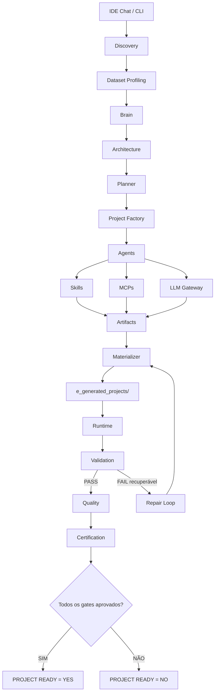
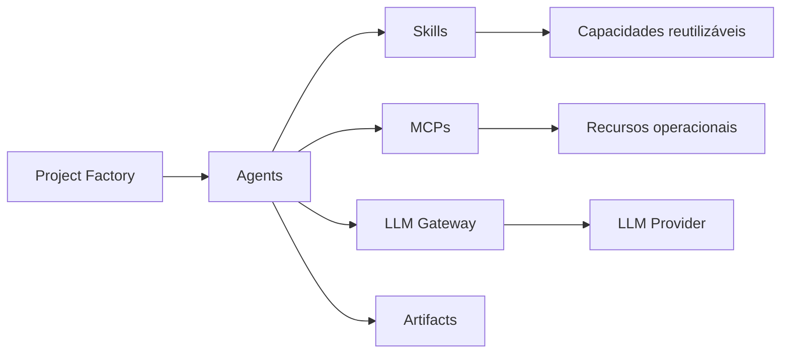
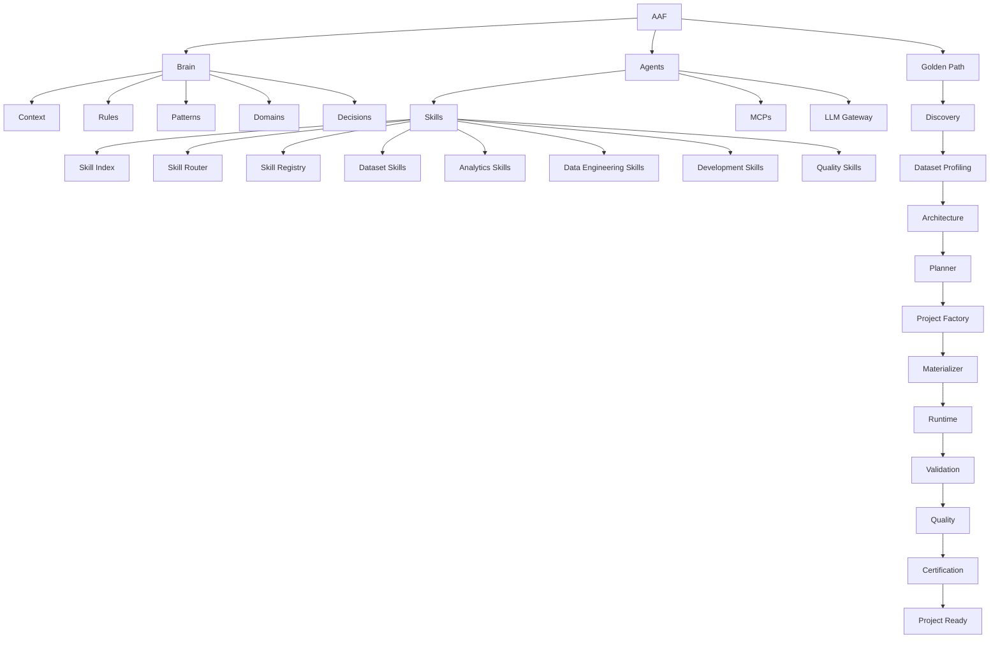
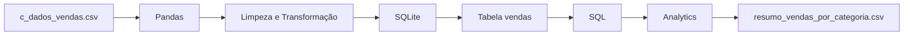
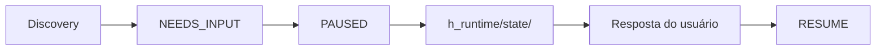
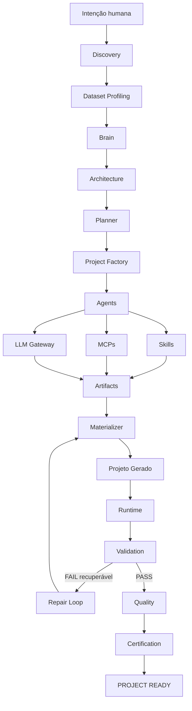

# Analytics Agents Factory (AAF)

## 1. Visão Geral

O **Analytics Agents Factory (AAF)** é uma plataforma multiagente especializada na geração automatizada de projetos de **Analytics e Data Engineering**.

O AAF recebe uma solicitação em linguagem natural, analisa requisitos e dados, define uma arquitetura, planeja a execução, coordena Agents especializados e materializa um projeto estruturado.

A proposta da plataforma não é apenas gerar código. O fluxo foi projetado para também executar, validar, avaliar qualidade e certificar o projeto produzido.

**Intenção → Planejamento → Geração → Execução → Validação → Projeto**

---

## 2. Objetivo

O objetivo do AAF é transformar uma necessidade de Analytics ou Data Engineering em um projeto executável utilizando uma fábrica composta por:

- **Brain** — contexto, regras, padrões, domínios e decisões;
- **Agents** — especialistas responsáveis por diferentes etapas;
- **Skills** — capacidades reutilizáveis utilizadas pelos Agents;
- **MCPs** — interfaces controladas para recursos operacionais;
- **LLM Gateway** — abstração para utilização de modelos de linguagem;
- **Project Factory** — coordenação da geração;
- **Materializer** — criação física dos arquivos;
- **Runtime** — execução do projeto gerado;
- **Validation** — validação estrutural e de execução;
- **Quality** — avaliação das evidências de qualidade;
- **Certification** — gate final de prontidão.

O AAF é **agnóstico ao domínio de negócio**, mas especializado tecnicamente em **Analytics e Data Engineering**.

---

## 3. Como Funciona

O Golden Path conceitual do AAF é:



### 3.1 Discovery

O `DiscoveryAgent` entende a solicitação, coleta requisitos relevantes e pode pausar a sessão quando uma decisão do usuário é necessária.

### 3.2 Dataset Profiling

Quando existe um dataset, o `DatasetProfilingSkill` utiliza Pandas para obter evidências reais como:

- quantidade de registros;
- quantidade de colunas;
- nomes das colunas;
- tipos;
- duplicidades;
- warnings relevantes.

### 3.3 Brain

O Brain funciona como o **SSOT operacional de conhecimento e contexto** do AAF.

Ele organiza:

- contexto;
- regras;
- padrões;
- domínios;
- decisões;
- relações entre conhecimentos.

### 3.4 Architecture

O `ArchitectureAgent` utiliza os requisitos, o profiling e o contexto do Brain para definir a arquitetura técnica do projeto.

### 3.5 Planner

O `PlannerAgent` transforma a arquitetura em um `ProjectPlan`, definindo:

- tarefas;
- Agents;
- Skills;
- MCPs;
- artifacts;
- comandos;
- evidências necessárias.

### 3.6 Project Factory

A `ProjectFactory` distribui as tarefas planejadas entre os Agents especializados e reúne os Artifacts produzidos.

### 3.7 Materializer

O Materializer transforma os Artifacts lógicos em arquivos físicos dentro de:

```text
e_generated_projects/<project_id>/
```

### 3.8 Runtime

O Runtime executa os comandos necessários do projeto gerado de forma controlada.

### 3.9 Validation e Repair Loop

O Validation verifica a estrutura e as evidências de execução.

Quando ocorre uma falha recuperável, o Repair Loop pode solicitar uma correção, materializar novamente, executar novamente e revalidar.

### 3.10 Quality

O Quality Engine avalia evidências relacionadas a testes, qualidade de código, segurança e dependências.

### 3.11 Certification

O Certification Engine consolida os gates obrigatórios.

Para que um projeto seja considerado pronto:

```text
Discovery        COMPLETE
Planning         COMPLETE
Materialization  SUCCESS
Execution        SUCCESS
Validation       PASS
Quality          PASS
Certification    PASS
        ↓
PROJECT READY = YES
```

Caso algum gate obrigatório falhe:

```text
PROJECT READY = NO
```

---

## 4. Estrutura do Projeto

```text
analytics_agents_factory/
├── .agents/
├── .obsidian/
├── a_platform/
│   ├── b_contracts/
│   ├── c_brain/
│   ├── e_skills/
│   ├── f_mcps/
│   ├── g_agents/
│   ├── h_factory/
│   ├── i_materializer/
│   ├── j_llm_gateway/
│   ├── k_runtime/
│   ├── l_validation/
│   ├── m_quality/
│   ├── n_certification/
│   └── o_orchestration/
├── b_input/
├── c_tests/
├── d_documentation/
│   ├── a_documentation_functional/
│   └── b_documentation_technical/
├── e_generated_projects/
├── f_cli/
├── g_configuration/
├── h_runtime/
│   └── state/
├── README.md
├── requirements.txt
├── Dockerfile
└── docker-compose.yml
```

---

## 5. Principais Componentes

### 5.1 `.agents/`

Contém regras e instruções utilizadas no desenvolvimento e manutenção do AAF.

### 5.2 `.obsidian/`

Contém a configuração do workspace utilizado para visualização da documentação e do grafo de conhecimento através do Obsidian.

O Obsidian atua como **camada de visualização e navegação para pessoas** e não como dependência de execução do Golden Path.

### 5.3 `a_platform/`

É o núcleo funcional da plataforma.

#### `b_contracts/`

Define contratos compartilhados entre os componentes, incluindo conceitos como:

```text
Project
AgentContract
SkillContract
MCPContract
Task
ProjectPlan
Artifact
Execution
ExecutionContext
State
Validation
Quality
Certification
```

#### `c_brain/`

Implementa o Brain do AAF.

```text
c_brain/
├── a_context/
├── b_rules/
├── c_patterns/
├── d_domains/
├── e_decisions/
├── f_graph/
├── g_brain.py
└── h_learning_engine.py
```

O `LearningEngine` existe estruturalmente, mas está fora do Golden Path operacional atual.

#### `e_skills/`

Contém capacidades reutilizáveis utilizadas pelos Agents.

```text
e_skills/
├── a_discovery/
├── b_dataset/
├── c_analytics/
├── d_data_engineering/
├── e_development/
├── f_quality/
├── declarations/
├── registry.py
├── skill_contract.py
├── skill_registry.py
├── skill_index.yaml
├── skill_index.py
└── skill_router.py
```

##### Skill Discovery and Multi-Skill Routing

O AAF utiliza um **Skill Index** compacto para descobrir capacidades disponíveis. O **Skill Router** suporta roteamento multi-skill (`1..N` capabilities por tarefa), resolvendo uma `SkillSelection` ordenada topologicamente por dependências (`depends_on`), deduplicada e filtrada por `allowed_skills` do Domínio e `allowed_agents` do Agente. O **SkillRegistry** resolve e carrega sob demanda (lazy loading) apenas cada Skill selecionada no instante de sua execução.

O fluxo de resolução e execução multi-skill é:

```text
Planner (Task + Capabilities [1..N])
  ↓
Agent
  ↓
SkillRouter.route_selection()
  ↓
SkillIndex (depends_on + allowed_agents)
  ↓
SkillSelection [1..N] (Deduplicada + Ordenada)
  ↓
SkillRegistry (carregamento sob demanda por skill_id)
  ↓
Selected Skill
  ↓
validate_input → execute → validate_output
```

**Agent é quem executa uma responsabilidade. Skill é aquilo que o Agent sabe fazer.**

#### `f_mcps/`

Contém os MCPs disponíveis:

```text
f_mcps/
├── a_filesystem/
├── b_database/
├── c_docker/
└── d_registry/
```

Os MCPs representam interfaces controladas para interação com recursos operacionais.

#### `g_agents/`

Contém os especialistas da fábrica.

```text
g_agents/
├── a_base/
├── b_discovery/
├── c_architecture/
├── d_planner/
├── e_data/
├── f_database/
├── g_analytics/
├── h_testing/
├── i_documentation/
├── j_backend/
├── k_frontend/
├── l_chatbot/
├── m_infrastructure/
├── n_factory/
├── o_registry/
└── p_declarations/
```

Agents principais:

- `DiscoveryAgent`
- `ArchitectureAgent`
- `PlannerAgent`
- `DataAgent`
- `DatabaseAgent`
- `AnalyticsAgent`
- `TestingAgent`
- `DocumentationAgent`

Agents como Backend, Frontend, Chatbot e Infrastructure são condicionais e dependem das necessidades do projeto.

#### `h_factory/`

Contém a `ProjectFactory`, responsável por coordenar a geração dos Artifacts através dos Agents.

#### `i_materializer/`

Responsável por transformar Artifacts em arquivos físicos.

Também aplica políticas para controlar os caminhos onde os arquivos podem ser materializados.

#### `j_llm_gateway/`

Abstrai a utilização dos modelos de linguagem.

```text
Agent / Skill
     ↓
LLM Gateway
     ↓
Provider
```

O objetivo é impedir que Agents e Skills fiquem diretamente acoplados a um fornecedor específico.

No Golden Path atual, o provider operacional é **OpenAI**.

Anthropic e Gemini permanecem estruturados, porém não fazem parte do provider operacional ativo atual.

#### `k_runtime/`

Execution Runtime responsável pela execução controlada dos projetos gerados.

Inclui a `CommandPolicy`, responsável por validar e controlar comandos permitidos.

A execução de subprocessos utiliza argumentos estruturados e `shell=False`.

#### `l_validation/`

Responsável pelo Validation Gate.

Verifica estrutura e evidências de execução antes de permitir a continuidade do projeto.

#### `m_quality/`

Contém o Quality Engine e as verificações relacionadas a qualidade, testes, segurança e dependências.

#### `n_certification/`

Responsável pela certificação final e consolidação dos gates obrigatórios.

#### `o_orchestration/`

Coordena o Golden Path completo.

Também contém o Repair Loop utilizado quando uma falha recuperável precisa ser corrigida e revalidada.

---

## 6. Relação entre Agents, Skills, MCPs e LLM



Em termos simples:

- **Agents** são os especialistas;
- **Skills** representam capacidades reutilizáveis;
- **MCPs** fornecem acesso controlado a recursos;
- **LLM Gateway** desacopla Agents e Skills do provider de LLM;
- **Artifacts** representam as entregas produzidas durante a geração.

---

## 7. Entrada de Dados

A pasta:

```text
b_input/
```

contém datasets utilizados como entrada para os projetos.

Entre os datasets utilizados no projeto está:

```text
c_dados_vendas.csv
```

Quando um dataset é fornecido ao workflow, o Dataset Profiling pode analisar fisicamente seu conteúdo antes da definição da arquitetura.

---

## 8. Testes

A pasta:

```text
c_tests/
```

centraliza a estratégia de testes da plataforma, incluindo testes unitários, integração, validação e cenários end-to-end.

---

## 9. Documentação

A documentação está organizada em duas perspectivas:

```text
d_documentation/
├── a_documentation_functional/
└── b_documentation_technical/
```

### Documentação Funcional

Explica **o que acontece** durante o Golden Path.

```text
AAF
 ↓
Discovery
 ↓
Dataset Profiling
 ↓
Brain
 ↓
Architecture
 ↓
Planner
 ↓
Project Factory
 ↓
Agents / Skills / MCPs / LLM
 ↓
Artifact
 ↓
Materializer
 ↓
Generated Projects
 ↓
Runtime
 ↓
Validation / Repair Loop
 ↓
Quality
 ↓
Certification
 ↓
Project Ready
```

### Documentação Técnica

Explica **como a plataforma é implementada**, incluindo:

- arquitetura;
- operação;
- Brain;
- Skills;
- MCPs;
- Agents;
- LLM Provider;
- CommandPolicy;
- Runtime;
- Validation;
- Quality e Certification;
- Obsidian;
- apresentação da arquitetura.

---

## 10. Brain e Obsidian

Brain e Obsidian possuem responsabilidades diferentes.

### Brain

O Brain é operacional.

Ele fornece ao AAF:

- contexto;
- regras;
- padrões;
- domínios;
- decisões;
- relações de conhecimento.

### Obsidian

O Obsidian é uma camada de visualização e navegação voltada para pessoas.

O Graph View permite visualizar as relações entre os principais conceitos da plataforma.



**Brain ajuda o AAF a trabalhar com conhecimento e contexto.**

**Obsidian ajuda uma pessoa a visualizar e navegar por esse conhecimento.**

O Obsidian não é uma dependência de execução do Golden Path.

---

## 11. Projetos Gerados

Os projetos materializados pelo AAF ficam em:

```text
e_generated_projects/
```

Cada projeto utiliza seu próprio diretório:

```text
e_generated_projects/<project_id>/
```

Essa separação permite que o projeto gerado seja executado e analisado de forma independente da implementação interna da plataforma.

---

## 12. Exemplo — ETL e Analytics de Vendas

O repositório contém um exemplo simples de projeto de ETL e Analytics:

```text
e_generated_projects/vendas_analytics/
├── README.md
├── requirements.txt
├── pipeline.py
├── test_pipeline.py
├── vendas.db
└── resumo_vendas_por_categoria.csv
```

A fonte utilizada é:

```text
b_input/c_dados_vendas.csv
```

### Fluxo do exemplo



### Transformações

O pipeline:

- lê o CSV;
- remove `*` dos campos necessários;
- converte datas;
- converte valores numéricos;
- valida IDs;
- remove duplicidades;
- carrega os registros tratados no SQLite.

### Analytics

Depois da carga, uma consulta SQL calcula:

- quantidade de vendas por categoria;
- faturamento total por categoria.

O resultado é exportado para:

```text
resumo_vendas_por_categoria.csv
```

### Executando o exemplo

Entre no projeto:

```bash
cd e_generated_projects/vendas_analytics
```

Crie e ative um ambiente virtual:

```bash
python3 -m venv venv
source venv/bin/activate
```

Instale as dependências:

```bash
python3 -m pip install -r requirements.txt
```

Execute:

```bash
python3 pipeline.py
```

O fluxo demonstrado é:

```text
CSV → Pandas/ETL → SQLite → SQL → Analytics → CSV
```

Para executar os testes do projeto:

```bash
python3 -m pytest test_pipeline.py -v
```

---

## 13. CLI do AAF

O ponto de entrada está em:

```text
f_cli/a_main.py
```

A CLI disponibiliza operações relacionadas a:

```bash
aaf start
aaf status
aaf result
aaf brain
aaf mcp
```

O `aaf start` inicia o fluxo de geração.

Quando o Discovery precisa de uma informação que realmente altera o projeto, a sessão pode entrar em estado de pausa e posteriormente ser retomada.

---

## 14. Session State

A plataforma diferencia dois conceitos de Runtime.

### Execution Runtime

```text
a_platform/k_runtime/
```

Responsável por executar os comandos dos projetos gerados.

### Session Runtime State

```text
h_runtime/state/
```

Responsável por persistir o estado operacional das sessões do próprio AAF.



---

## 15. Guardrails

O AAF possui diferentes mecanismos de controle ao longo do fluxo:

- contratos tipados;
- validação de Agents;
- Skill Registry;
- MCP Registry;
- validação de domínio;
- CommandPolicy;
- PathPolicy;
- Validation Gate;
- Quality Engine;
- Certification Engine;
- evidências tipadas de execução.

O objetivo é evitar que uma simples geração de arquivos seja interpretada como evidência de que um projeto está pronto.

---

## 16. Limitações Atuais

O projeto possui algumas limitações explicitamente reconhecidas:

- o Golden Path é especializado em Analytics e Data Engineering;
- OpenAI é o provider operacional ativo do LLM Gateway;
- Anthropic e Gemini não fazem parte do fluxo operacional ativo atual;
- o Learning Engine está fora do Golden Path;
- a IDE atua como interface/transporte, enquanto o raciocínio da fábrica pertence aos componentes internos do AAF;
- a existência de um projeto materializado não significa automaticamente que todo o Golden Path E2E do AAF foi homologado.

---

## 17. Definition of Ready

Um projeto está pronto para entrar no processo de geração quando:

- os requisitos necessários foram compreendidos;
- o contexto relevante foi identificado;
- datasets disponíveis foram analisados quando aplicável;
- o Brain Context está disponível para arquitetura e planejamento.

---

## 18. Definition of Done

O objetivo final do Golden Path é atingir:

| Gate | Estado esperado |
|---|---|
| Discovery | `COMPLETE` |
| Planning | `COMPLETE` |
| Materialization | `SUCCESS` |
| Execution | `SUCCESS` |
| Validation | `PASS` |
| Quality | `PASS` |
| Certification | `PASS` |

Somente com todos os gates aprovados:

```text
PROJECT READY = YES
```

Caso contrário:

```text
PROJECT READY = NO
```

---

## 19. Resumo da Arquitetura



### Responsabilidades

| Componente | Responsabilidade |
|---|---|
| **Brain** | Conhecimento, contexto e regras |
| **Agents** | Especialistas |
| **Skills** | Capacidades reutilizáveis |
| **MCPs** | Acesso controlado a recursos |
| **LLM Gateway** | Abstração do provider de LLM |
| **Project Factory** | Coordenação da geração |
| **Materializer** | Criação física dos arquivos |
| **Runtime** | Execução |
| **Validation** | Validação |
| **Repair Loop** | Recuperação de falhas |
| **Quality** | Avaliação das evidências de qualidade |
| **Certification** | Gate final de prontidão |

---

## 20. Conclusão

O **Analytics Agents Factory** organiza a geração de projetos de Analytics e Data Engineering através de uma arquitetura multiagente com responsabilidades especializadas.

O fluxo conecta **Brain, Agents, Skills, MCPs e LLM Gateway** à geração, materialização, execução, validação, qualidade e certificação dos projetos.

O AAF não é apenas um Agent que gera código: é uma fábrica multiagente projetada para transformar uma intenção em uma implementação **estruturada, executável e validável**.