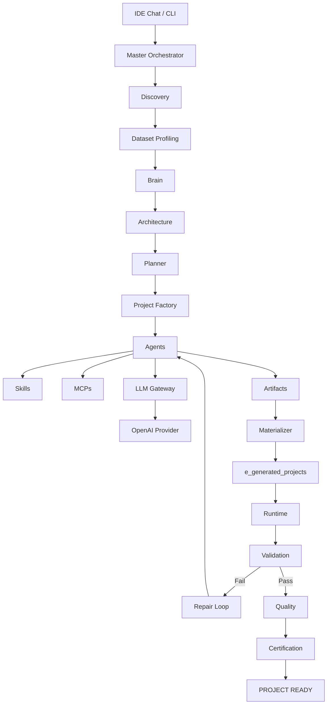
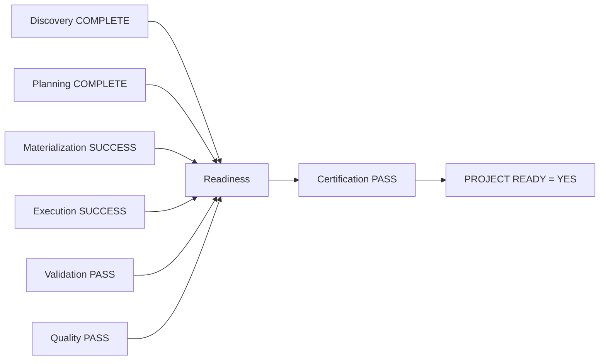

# Analytics Agents Factory (AAF)

## 1. Propósito
O Analytics Agents Factory (AAF) é uma plataforma para geração automatizada de projetos de Analytics e Data Engineering. O AAF recebe solicitações em linguagem natural e materializa repositórios estruturados e executáveis através de uma pipeline baseada em múltiplos agentes, ferramentas MCP (Model Context Protocol), e validação de código rigorosa. O propósito é garantir a geração de um artefato final ("PROJECT READY") com base em evidências de execução com sucesso e validação de estrutura.

## 2. Escopo
O escopo do projeto compreende as seguintes funcionalidades centrais de infraestrutura e engenharia de software:
- Coleta de metadados, contexto e requisitos via interação de Chat (CLI ou IDE).
- Profiling de datasets físicos para ancorar as capacidades dos LLMs em esquemas de dados reais.
- Extração de padrões arquiteturais e conhecimento através de um "Brain".
- Planejamento algorítmico, modular, com uma cadeia de geração usando agentes especializados e Skills (MCPs).
- Geração material do projeto e subsequente execução estruturada (runtime isolado).
- Avaliação criteriosa por meio de Quality e Certification Engines focadas em _evidências_ concretas (logs, códigos de saída e falhas estruturais).
- Repair Loop acionado automaticamente quando ocorrem erros estruturais ou de execução de processos.

## 3. O que o AAF Gera
- Projetos completos em Data Engineering, como extração de dados, scripts SQL, pipelines de processamento ETL/ELT e automações estruturadas e tipadas em Python.
- Projetos de Data Analytics, dashboards conceituais (ou estrutura pronta para tais), modelos e análises exploratórias.
- Arquitetura robusta de repositório de dados: contêineres Docker, scripts CLI e artefatos testáveis para análise de dados e implantação na nuvem.

## 4. O que o AAF NÃO Pretende Gerar
- O AAF não foca no desenvolvimento generalista de Software Web (Frontend/Webapps), não cria Microserviços avulsos sem relação a dados, nem cria aplicativos móveis. O domínio base sempre será restrito ao conhecimento prévio do *Brain*, direcionado exclusivamente a `analytics` e `data_engineering`.

## 5. Arquitetura Modular Monolith
O sistema adere a uma arquitetura de Monolito Modular orientada a Domínio (DDD) implementada em Python. As partes não cruzam limites de pacote inadvertidamente, não há dependência cíclica, a configuração é tratada top-down e contratos/interfaces residem estritamente no pacote `b_contracts`. Nenhuma skill acessa provedores de LLM externos sem passar pelo LLM Gateway, nem agentes criam artefatos físicos no disco pulando a Factory ou Materializer.

## 6. Fluxo Completo



## 7. Componentes Principais

### Agents
Agentes funcionam como _Reasoning Engines_ dentro de suas zonas de domínio:
- **DiscoveryAgent**: Coleta dados e o escopo funcional inicial.
- **ArchitectureAgent**: Decide quais capacidades, padrões e módulos a arquitetura necessitará com base no conhecimento do Brain.
- **PlannerAgent**: Desenha um plano de execução, gerando tasks atômicas a serem processadas pelo Project Factory.
- **Feature/Execution Agents**: Agentes especializados invocados para transformar tasks atômicas e Skills em Artifacts compilados para construção de código.

### Skills
Capacidades granulares baseadas em métodos assíncronos. Exigem que o provedor LLM forneça respostas consistentes baseadas nos parâmetros exigidos, ou aplicam execução física nativa (ex: `DatasetProfilingSkill` através do Pandas). Exemplos: `EtlScriptingSkill`, `SqlGenerationSkill`, `ApiDesignSkill`.

### MCPs
Model Context Protocol Tools. O AAF disponibiliza MCPs reais, funcionais e isoladas:
- **Filesystem**: Operações estruturadas de leitura/escrita e validação de sistema de arquivos local.
- **Database**: Ferramenta de querying ou modelagem isolada de dados SQL (Opcional base).
- **Docker**: Suporte a containerização de processos (Opcional base).

### Brain
Cérebro do conhecimento contextual. Garante aderência aos *Global Rules*, domínios permitidos, decisões arquiteturais consolidadas e injeta "regras de padrão da equipe" no _ExecutionContext_.

### LLM Gateway
Roteador único (ModelRouter) que recebe uma requisição e encapsula um provedor genérico LLM, impedindo que o AAF crie um lock-in severo. Implementado atualmente para a infraestrutura *OpenAI*. Providers como *Gemini* e *Anthropic* declaram-se não implementados `NotImplementedError` até uso físico homologado e exigem obrigatoriamente a apiKey (sem chaves mockadas).

### Project Factory
Responsável por orquestrar Agents (Através do `AgentFactory`) para processar e processar a conversão das Tarefas Planejadas em objetos `Artifact` Pydantic completos em disco lógico (não físico).

### Materializer
Converte a árvore lógica originada da _Project Factory_ e materializa os arquivos de forma estrita no path físico, manipulando os MCPs de filesystem e permissões para alocar projetos fisicamente.

### Runtime
Componente que encapsula `subprocess` e garante segurança na execução restrita (`shell=False`, timouts explícitos, limites globais, políticas de comandos) e mapeia _cada comando individualmente_ para uma lista tipada `CommandExecutionResult`. Ele compila a execução num `ExecutionResult` final.

### Validation
Motor de validações sistêmicas:
- **ProjectValidation**: Verifica ID, consistência de propriedades de projeto.
- **StructureValidation**: Testa presença estática de arquivos essenciais.
- **ExecutionValidation**: Lê evidências dos comandos emitidos (`CommandExecutionResult.status == PASSED` e `return_code == 0`). Nega permissão se encontrar um `DENIED` emitido pela `CommandPolicy` ou `TIMEOUT`. 

### Repair Loop
Quando o `Validation` ou a própria `Execution` falham, este loop devolve as *evidências base* de volta ao Agent respectivo para nova elaboração, até um limite máximo (default 3 tentativas). Apenas respostas re-materializadas e avaliadas com sucesso no Runtime + Validation Gates indicam que o *Repair Loop* funcionou (não existe mock ou fake success de log).

### Quality
Identifica, sem usar substrings textuais genéricas e apenas via argv executável (`CommandExecutionResult.executable`), se ferramentas de Code Quality e Security Quality (`ruff`, `flake8`, `bandit`, `pip check`) foram acionadas de fato. Caso contrário, `NOT_EXECUTED` mapeia rigorosamente para `FAILED`. 

### Certification
Single Source of Truth para carimbar que um projeto atingiu qualidade técnica superior: `Certification Engine`. Centraliza as passagens: _Discovery_, _Planning_, _Materialization_, _Execution_, _Validation_ e _Quality_. Qualquer `FAIL` anula a obtenção do status.

### PROJECT READY



## 8. Estrutura do Repositório

```text
analytics_agents_factory/
├── .agents/                    # Regras adicionais
├── .obsidian/                  # Configurações do Obsidian Knowledge Graph
├── a_platform/                 # Motor Central do AAF
│   ├── b_contracts/            # Interfaces e Modelos de Pydantic Base (Domain Data)
│   ├── c_brain/                # Core de Conhecimento e Políticas Globais
│   ├── e_skills/               # Assinaturas e Logicas granulares (LLM e Físico)
│   ├── f_mcps/                 # Protocolos e Integração com Filesystem/Docker/DB
│   ├── g_agents/               # Discovery, Architecture, Planner, e outros agents
│   ├── h_factory/              # Project Factory
│   ├── i_materializer/         # Manipulador Físico de Arquivos
│   ├── j_llm_gateway/          # Conectores com LLMs (OpenAI, Anthropic, Gemini)
│   ├── k_runtime/              # Pipeline Executivo Seguro e Controlado (shlex, shell=False)
│   ├── l_validation/           # Validação Gate Lógica e Física de Projetos
│   ├── m_quality/              # Code e Dependency e Security Checkers
│   ├── n_certification/        # Motor Único de Autorização de Readiness de Projetos
│   └── o_orchestration/        # Master Orchestrator (O Pipeline do AAF) e Repair Loop
├── b_input/                    # Inputs (Configurações base para injetar)
├── c_tests/                    # Testes de Código (Mocks aceitos unicamente aqui)
├── d_documentation/            # Documentação rica dividida por domínios e componentes
├── e_generated_projects/       # Path exclusivo e centralizado dos Projetos Materializados
├── f_cli/                      # Ponto de acesso do usuário de Terminal (CLI Commands)
├── g_configuration/            # Settings
├── h_scripts/                  # Utilitários Adicionais
├── Dockerfile                  # Container do projeto AAF
├── docker-compose.yml          # Containerização e orquestração do projeto
├── README.md                   # Esta Documentação
└── requirements.txt            # Dependências em Python
```

## 9. Configuração e Segurança de Execução
A configuração é realizada por meio do `g_configuration/`. 
Políticas restritas existem sob `a_platform/k_runtime/b_command_policy/`. Subprocessos ocorrem invariavelmente via argumentos explícitos.
Shell execution está bloqueada (`shell=False`).
As APIs do *Anthropic* e *Gemini* lançam *NotImplementedError* uma vez que o AAF depende majoritariamente de conexões padronizadas via API do *OpenAI* ou SDK *OpenAI* em `j_llm_gateway`. 

## 10. CLI
O ponto de entrada CLI suportado usa o arquivo `f_cli/a_main.py`.

**Comandos Disponíveis:**
- `aaf start --project-id <id> --prompt <descricao> [--dataset <path>]`: Inicia o fluxo de pipeline do AAF.
- `aaf status <project_id>`: Consulta o estado de Readiness e Transição do Projeto especificado.
- `aaf result <project_id>`: Retorna a prova de materialização e Certification result gerado para um Project_Id.
- `aaf brain`: Expõe de forma global políticas registradas de *Brain* e configurações carregadas.
- `aaf mcp`: Lista as capacidades/MCPS reais disponíveis para geração.

*(A utilização manual de python modules via -m como `python -m a_platform.b_interfaces.b_cli.b_cli` está obsoleta).*

## 11. Entrada de Datasets
Ao iniciar o workflow (`aaf start`), pode ser fornecido o parâmetro estrito `--dataset`. A skill física `DatasetProfilingSkill` fará uma verificação imediata via `Pandas` do esquema dos dados, e disponibilizará inferências e metadados lidos fisicamente no *Brain Context* antes da geração da Arquitetura do projeto. 

## 12. Projetos Gerados
Qualquer conteúdo construído com sucesso que receber `Materialization = SUCCESS` estará contido _única e exclusivamente_ no repositório `e_generated_projects/<ID do Projeto>`. Os testes e verificações de Validação correrão neste path isolado, onde todas as manipulações de comando de runtime possuirão um `cwd` confinado para assegurar sanidade. 

## 13. Observabilidade e Evidências
Cada comando despachado pelo sistema pelo Pipeline Executivo de Runtimes é documentado e avaliado pela entidade `CommandExecutionResult`. A ausência de logs textuais de falha não significa aprovação. Componentes sistêmicos dependem de *Evidências Tipadas* no retorno de `exec_obj`.

## 14. Golden Paths Suportados
O Golden Path suporta _Data Engineering_ e _Analytics_. Tentar solicitar um projeto WebApp Front-end moderno (Next.js, Vue), Servidor Rust nativo, e domínios não alinhados farão o pipeline falhar com erro de "Domínio técnico inválido ou ausente". 

## 15. Limitações Atuais
- O Learning Engine (Cérebro autoadaptável) se encontra fora do Golden Path.
- Suporte homologado apenas para OpenAI provider, provedores Gemini e Anthropic retornarão `NotImplementedError` caso sejam tentados em modo _dummy_. 
- Apenas CLI é a interface estática interativa testada do sistema. O uso nativo sem CLI precisaria configurar o `MasterOrchestrator` de forma customizada.

## 16. Troubleshooting e Demonstração Recomendada
Para verificar inconsistências:
1. Revise se o `project_id` passado pelo CLI não está em uso.
2. Certifique-se que o pacote principal de dependências (pip install -r requirements.txt) está completo, permitindo validações base do `Project Factory`.
3. Verifique se o `OPENAI_API_KEY` encontra-se exportado na sua máquina (ex: `export OPENAI_API_KEY=...`).
4. Execute `aaf mcp` para verificar a sanidade do Registry.
5. Inicie um _Hello World_ simples:
   `python f_cli/a_main.py start --project-id etl_simple --prompt "Crie um script de ETL que leia um csv de clientes em data/ e escreva um csv de output em output/"`

## 17. Obsidian Graph
As visualizações da arquitetura e inter-relações via grafos e Knowledge bases, formatadas em _Obsidian_, estão suportadas na raiz da pasta _d_documentation/_. Utilizar o plugin de Obsidian para acessar a topologia física da plataforma em modo Wiki.

## 18. Definition of Ready
- Os requisitos foram compreendidos pelo Discovery Engine.
- Contexto enriquecido de Metadados e Profile injetados pelo Master Orchestrator. 
- Brain Context instanciado.

## 19. Definition of Done
- Fluxo _Certification Engine_ atestado como _PASSED_.
- Propriedade MasterOrchestrator em _PROJECT READY = YES_ impressa.
- Arquivos localizados e garantidos que não há falsos-positivos em _Validation_ ou _Execution_ dentro do subdiretório `e_generated_projects/`.
