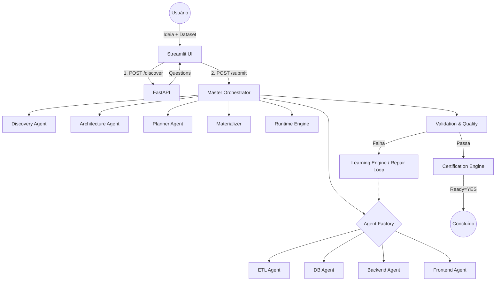

# Analytics AI Factory (AAF) 🏭 v1.0 Real

A Analytics AI Factory é uma plataforma autônoma projetada para criar pipelines de dados, arquiteturas analíticas e dashboards de forma end-to-end. Ela não apenas gera o código, mas materializa, valida localmente, entra em um loop de autocorreção (Repair Loop) e emite um certificado final de prontidão.

## 🌟 Visão Geral e Proposta

A AAF substitui a geração de templates estáticos por uma fábrica inteira baseada em Agentes de IA Especialistas. Você entra com um prompt e, opcionalmente, um dataset (CSV, JSON, Parquet). O motor infere requisitos, faz perguntas de refinamento (Discovery), desenha o plano arquitetural, materializa os arquivos Python/SQL e executa testes locais reais para garantir que o projeto funciona!

## 🗺️ Fluxo de Execução E2E (Diagrama de Arquitetura)



## ⚖️ A Regra Absoluta de Certificação
`PROJECT READY = YES` **SOMENTE SE**:
1. Todos os agentes terminarem a geração com sucesso.
2. O código for materializado e testado localmente pelo **RuntimeEngine**.
3. O **ValidationGate** não encontrar exceções nem quebras de dependência.
4. O **QualityEngine** aprovar as regras estáticas de linting.

Se o código gerado falhar (ex: erro de import), o **Repair Loop** é acionado. A falha vai para o `LearningEngine`, que instrui a Fábrica a refazer a etapa errada. Após 3 tentativas falhas, `PROJECT READY = NO`.

## 🚀 Guia de Instalação e Execução

### Pré-requisitos
- Python 3.11+
- Uma chave de API (Ollama ou LLM compatível configurado no `.env`)

```bash
# Clone e entre no diretório
cd analytics_agents_factory

# Instale dependências
python -m venv .venv
source .venv/bin/activate
pip install -r requirements.txt
```

### 1. API Backend
Inicie a orquestração e a API REST FastAPI:
```bash
python main.py serve-api
```
(A API ficará disponível em `http://127.0.0.1:8000`)

### 2. Interface Web (UI)
Com a API rodando, abra um novo terminal e inicie a interface interativa:
```bash
python main.py serve-ui
```
(A UI ficará disponível no navegador via Streamlit)

### 3. CLI (Terminal)
Se quiser rodar a fábrica diretamente via script sem UI:
```bash
python main.py cli "Crie um pipeline ETL simples para análise de vendas" --dataset path/to/data.csv
```

## 📂 Estrutura de Diretórios
- `a_platform/`: Motores de execução física, testes reais, materializador, API e UI.
- `b_brain/`: Grafos (Obsidian Graph), Padrões de arquitetura, Regras absolutas.
- `c_agents/`: Os Agentes LLM Especialistas (Discovery, Planner, ETL, DevOps, QA, etc.).
- `d_skills/`: Funcionalidades estáticas plugáveis, como o Profiler Estatístico (`profiler.py`).
- `e_generated_projects/`: Onde seu código pronto, testado e certificado aparece magicamente.
