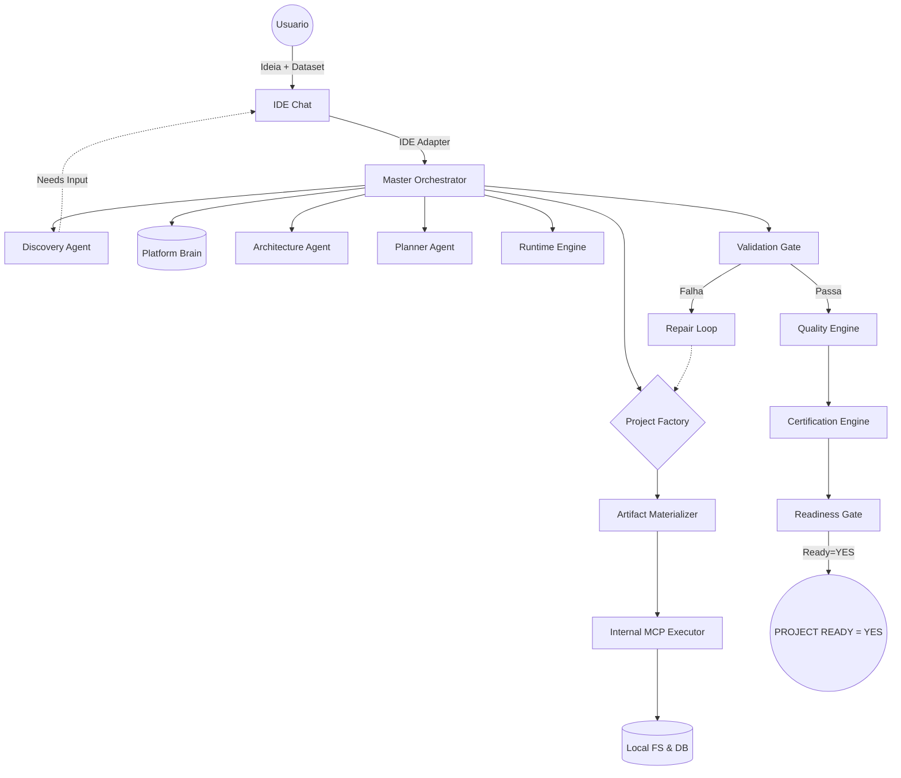

# Analytics AI Factory

A Analytics AI Factory é uma plataforma autônoma projetada para criar pipelines de dados, arquiteturas analíticas e web apps de forma end-to-end. Ela não apenas gera o código, mas materializa, valida localmente via MCP, entra em um loop de autocorreção (Repair Loop) e emite um certificado final de prontidão de acordo com a Regra Absoluta do Projeto Pronto.

## Visão Geral e Proposta

A AAF substitui a geração de templates estáticos por uma fábrica inteira baseada em Agentes de IA Especialistas. Você entra com um prompt na IDE Chat, o motor infere requisitos, faz perguntas de refinamento iterativas na mesma thread (Discovery), desenha o plano arquitetural, materializa os arquivos Python/SQL e executa testes locais reais (Runtime Engine) para garantir que o projeto funciona.

## Fluxo de Execução E2E (Ciclo de Vida)

O motor orquestra a inteligência seguindo rigorosamente o fluxo obrigatório:
**IDE Chat -> IDE Adapter -> Discovery -> Brain -> Architecture -> Planner -> Factory -> Materialization -> Execution -> Validation -> Repair -> Quality -> Certification -> Readiness**

1. **Discovery**: Refinamento interativo com o usuário na IDE Chat.
2. **Brain**: Resgate de histórico de projetos e lições aprendidas.
3. **Architecture**: Definição da stack tecnológica.
4. **Planner**: Geração do DAG de execução validado.
5. **Factory**: Execução dos agentes de código (Data, DB, etc).
6. **Materialization**: Escrita física dos artefatos usando MCP.
7. **Execution**: Inicialização de ambiente virtual e testes reais via Runtime.
8. **Validation**: Testes unitários gerados sendo validados.
9. **Repair**: Loop de correção automatizada em falhas.
10. **Quality**: Varredura via Linter e SecurityScanner.
11. **Certification**: Homologação multietapas da aderência técnica.
12. **Readiness**: Gatilho absoluto que afere se todas as etapas estão prontas.



## A Regra Absoluta de Certificação
`PROJECT READY = YES` exclusivamente se:
- `Discovery=COMPLETE`
- `Planning=COMPLETE`
- `Materialization=SUCCESS`
- `Execution=SUCCESS`
- `Validation=PASS`
- `Quality=PASS`
- `Certification=PASS`

Caso contrário, `PROJECT READY = NO`.

## Guia de Uso Rápido e Documentação Operacional

A documentação detalhada e passo a passo está localizada na pasta `b_documentation/guides/`. Recomendamos fortemente a leitura dos guias operacionais antes de iniciar.

- [Guia de Instalação](b_documentation/guides/installation.md)
- [Guia da Interface IDE Chat (Principal)](b_documentation/guides/ide_chat_usage.md)
- [Guia da Interface CLI (Secundária)](b_documentation/guides/cli_usage.md)
- [Guia da Interface Web UI](b_documentation/guides/web_ui_usage.md)
- [Roteiro de Testes e Homologação](b_documentation/guides/testing_and_validation.md)

### Resumo de Instalação e Execução via CLI
```bash
# Clone e crie o ambiente virtual
python -m venv venv
source venv/bin/activate
pip install -r requirements.txt

# Configure as chaves de API (duplique .env.example para .env)
# Rode um projeto de exemplo via CLI
python main.py create "Crie uma API FastAPI de gestão de usuarios"
```

## Estrutura de Diretórios Canônica
- `a_platform/`: O coração do AAF.
  - `a_core/`: State Manager, Domain Models, Readiness Gate e Master Orchestrator.
  - `b_interfaces/a_ide/`: IDE Adapter - o portão oficial de entrada.
  - `c_brain/`: Graph Builder, Backends Obsidian/Graphify, Memory.
  - `d_agents/`: Agentes especialistas (Discovery, Planner, Architecture).
  - `e_skills/`: Funcionalidades plugáveis estritas.
  - `f_mcp/`: Executores de sistema real (Database SQLite, Git, Filesystem).
  - `g_llm_gateway/`: O provedor único de LLM da plataforma.
  - `h_factory/`: A orquestradora de criação e o Materializador.
  - `i_domains/`: Modelos e templates específicos por domínio.
  - `j_runtime/`, `k_validation/`, `l_quality/`, `m_certification/`: As catracas da Prova de Fogo.
  - `n_learning/`: Repair loop de correção automatizada em falhas.
- `b_documentation/`: Documentação geral (arquitetura, funcional, técnica, etc).
- `c_tests/`: Suíte completa de testes (unitários, integração, e2e, etc).
- `d_input/`: Entradas de dados (datasets, requests, exemplos).
- `e_generated_projects/`: Onde seu código pronto, testado e certificado aparece magicamente.
- `.aaf_state/`: Ponto de salvamento dos projetos em andamento.
