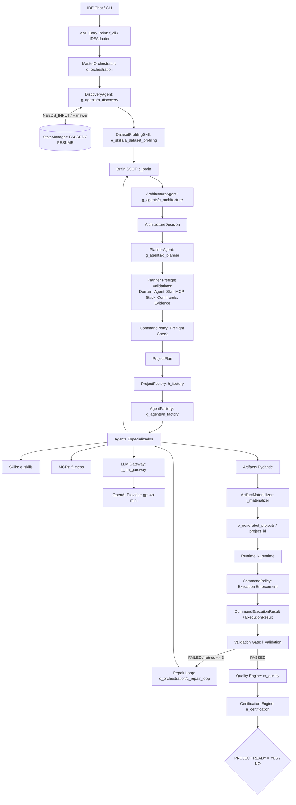
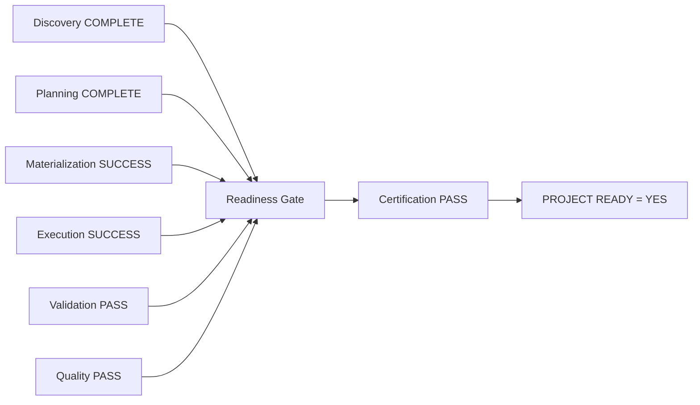

# Analytics Agents Factory (AAF)

## 1. Propósito
O Analytics Agents Factory (AAF) é uma plataforma para geração automatizada de projetos de Analytics e Data Engineering. O AAF recebe solicitações em linguagem natural e materializa repositórios estruturados e executáveis através de uma pipeline baseada em múltiplos agentes, ferramentas MCP (Model Context Protocol), e validação de código rigorosa. O propósito é garantir a geração de um artefato final ("PROJECT READY") com base em evidências de execução com sucesso e validação de estrutura.

## 2. Escopo
O escopo do projeto compreende as seguintes funcionalidades centrais de infraestrutura e engenharia de software:
- Coleta de metadados, contexto e requisitos via interação de Chat (CLI ou IDE).
- Profiling de datasets físicos para ancorar as capacidades dos LLMs em esquemas de dados reais.
- Extração de padrões arquiteturais e conhecimento através de um "Brain".
- Planejamento algorítmico, modular, com uma cadeia de geração usando agentes especializados e Skills (MCPs).
- Geração material do projeto e subsequente execução estruturada (runtime isolado).
- Avaliação criteriosa por meio de Quality e Certification Engines focadas em _evidências_ concretas (logs, códigos de saída e falhas estruturais).
- Repair Loop acionado automaticamente quando ocorrem erros estruturais ou de execução de processos.

## 3. O que o AAF Gera
- Projetos completos em Data Engineering, como extração de dados, scripts SQL, pipelines de processamento ETL/ELT e automações estruturadas e tipadas em Python.
- Projetos de Data Analytics, dashboards conceituais (ou estrutura pronta para tais), modelos e análises exploratórias.
- Arquitetura robusta de repositório de dados: contêineres Docker, scripts CLI e artefatos testáveis para análise de dados e implantação na nuvem.

## 4. O que o AAF NÃO Pretende Gerar
- O AAF não foca no desenvolvimento generalista de Software Web (Frontend/Webapps), não cria Microserviços avulsos sem relação a dados, nem cria aplicativos móveis. O domínio base sempre será restrito ao conhecimento prévio do *Brain*, direcionado exclusivamente a `analytics` e `data_engineering`.

## 5. Arquitetura Modular Monolith
O sistema adere a uma arquitetura de Monolito Modular orientada a Domínio (DDD) implementada em Python. As partes não cruzam limites de pacote inadvertidamente, não há dependência cíclica, a configuração é tratada top-down e contratos/interfaces residem estritamente no pacote `b_contracts`. Nenhuma skill acessa provedores de LLM externos sem passar pelo LLM Gateway, nem agentes criam artefatos físicos no disco pulando a Factory ou Materializer.

### Separação Estrita de Responsabilidades: IDE Chat vs Agents Nativos do AAF
- **IDE Chat (Interface e Transporte):** O chat da IDE atua estritamente como canal de entrada/saída e camada de transporte com o usuário. O comando `aaf start` é a invocação do ponto de entrada do AAF; **não** constitui autorização para o agente da IDE gerar arquivos de projeto, criar scripts manuais de contorno ou alterar o código-fonte da plataforma durante solicitações de geração.
- **Agents Internos do AAF:** Todo o raciocínio, levantamento de requisitos, arquitetura, planejamento, geração de código e verificação pertencem com exclusividade aos agentes nativos da plataforma (`DiscoveryAgent`, `ArchitectureAgent`, `PlannerAgent`, `ProjectFactory`, etc.) orquestrados pelo `MasterOrchestrator`.

## 6. Fluxo Completo de Funcionamento



## 7. Componentes Principais

### Discovery e Ciclo de Pause / Resume
- O **DiscoveryAgent** coleta metadados e requisitos de negócio. 
- Quando dados essenciais estão ausentes e não são inferíveis de defaults da fábrica, o agente emite `missing_info_question`, transicionando a sessão para o estado `NEEDS_INPUT` (`PAUSED`) via `StateManager` (`j_state_manager.py`).
- O usuário responde diretamente à pergunta pendente na **mesma sessão** através de `aaf start --project-id <id> --answer "<resposta>"`. A sessão é retomada de forma idempotente sem perda de histórico nem reinício do Discovery.
- Se um dataset for fornecido (`--dataset`), o Discovery proíbe perguntas redundantes sobre características físicas do arquivo (linhas, colunas, tipos), delegando essa análise estritamente à etapa subsequente de `DatasetProfilingSkill`.

### Dataset Profiling
Skill física nativa executada via Pandas (`DatasetProfilingSkill`) para extração determinística de metadados estruturais (`row_count`, `column_count`, `columns`, tipos brutos, duplicatas, warnings), injetando evidências concretas no contexto antes da tomada de decisão arquitetural.

### Brain (SSOT)
Cérebro de conhecimento contextual. Centraliza regras de arquitetura (`b_rules`), domínios (`d_domains`), decisões registradas (`e_decisions`) e padrões de engenharia. O *Learning Engine* (`h_learning_engine.py`) encontra-se fora do Golden Path oficial de produção.

### Architecture
O **ArchitectureAgent** analisa o contexto enriquecido do Brain e do dataset, gerando a decisão arquitetural formal (`ArchitectureDecision`) com restrições tecnológicas de stack, persistência e modelagem analítica.

### Planning e Validações Pré-Execução
O **PlannerAgent** atua como Single Source of Truth do plano de execução (`ProjectPlan`). Durante o planejamento, o agente realiza validações estritas de:
- **Domínio técnico:** restrito a analytics e data engineering;
- **Agent Registry / Factory:** apenas agentes formalmente autorizados no domínio;
- **SkillRegistry:** validação de skills declaradas no catálogo `b_skills.yaml`;
- **MCP Registry:** verificação de ferramentas de I/O autorizadas;
- **Stack tecnológico e dependências:** compatibilidade com as premissas arquiteturais;
- **CommandPolicy Preflight:** verificação estática prévia de cada comando de execução;
- **Requisitos de evidência tipada:** comandos obrigatórios para geração de evidências concretas.

### CommandPolicy: Atuação em Duas Posições
A **CommandPolicy** (`a_platform/k_runtime/b_command_policy/`) atua de forma preventiva e em tempo de execução:
1. **Planning (Preflight):** Valida estaticamente os comandos propostos no plano antes da instanciação de tarefas, rejeitando binários proibidos ou sintaxes inseguras.
2. **Runtime (Enforcement):** Aplica a política de isolamento no momento da execução dos subprocessos em `k_runtime`, exigindo argumentos estruturados (`shlex`, `shell=False`) e bloqueando chamadas não autorizadas (`DENIED`).

### Project Factory e Materializer
- **ProjectFactory:** Orquestra os agentes via `AgentFactory` para converter as tarefas planejadas em objetos Pydantic `Artifact` lógicos.
- **ArtifactMaterializer (`i_materializer`):** Grava fisicamente os arquivos de forma estrita no path seguro `e_generated_projects/<project_id>`, manipulando permissões e isolamento.

### Runtime e Observabilidade
Encapsula a execução de subprocessos (`shell=False`, timeouts explícitos, limites globais). Cada comando executado produz uma entidade tipada `CommandExecutionResult` contendo código de saída, stdout, stderr, duração e status. A ausência de erros de texto não constitui aprovação; a plataforma exige evidências tipadas de conclusão com sucesso.

### Validation Gate e Repair Loop
- **ValidationGate (`l_validation`):** Avalia validações estruturais e evidências de execução (`CommandExecutionResult.status == PASSED` e `return_code == 0`).
- **RepairLoop (`o_orchestration/c_repair_loop.py`):** Em caso de falha de validação ou execução, reencaminha os diagnósticos de erro ao respectivo agente para nova elaboração, com limite de até 3 tentativas (`max_repair_attempts`). Se as tentativas se esgotarem sem sucesso, a orquestração falha definitivamente.

### Quality Engine
Avalia, por meio do argv executável (`CommandExecutionResult.executable`), se os verificadores de Code Quality, Testes e Segurança (`pytest`, `ruff`, etc.) foram de fato acionados. Se não executados, são classificados como `FAILED`. Exige nota mínima (>= 0.75) e pontuação máxima (1.0) nas dimensões críticas.

### Certification Engine e Regra de PROJECT READY
A **CertificationEngine** (`n_certification`) atua como juiz supremo.

**Fórmula Canônica de Readiness:**
`PROJECT READY = YES` é emitido **exclusiva e imutavelmente** se e somente se:
- `Discovery` = COMPLETE
- `Planning` = COMPLETE
- `Materialization` = SUCCESS
- `Execution` = SUCCESS (`CommandExecutionResult.status == PASSED` e `return_code == 0`)
- `Validation` = PASS
- `Quality` = PASS
- `Certification` = PASS (`CertificationResult.passed == True`)

Se qualquer uma das etapas falhar, o veredito final é inegociável: `PROJECT READY = NO` sob estado `FAILED`. Nenhum default passivo ou flag simulada é tolerado.



## 8. Estrutura do Repositório

```text
analytics_agents_factory/
├── .agents/
│   └── a_rules/
├── .obsidian/
├── a_platform/
│   ├── b_contracts/
│   ├── c_brain/
│   ├── e_skills/
│   ├── f_mcps/
│   ├── g_agents/
│   ├── h_factory/
│   ├── i_materializer/
│   ├── j_llm_gateway/
│   ├── k_runtime/
│   ├── l_validation/
│   ├── m_quality/
│   ├── n_certification/
│   └── o_orchestration/
├── b_input/
│   └── a_datasets/
├── c_tests/
├── d_documentation/
├── e_generated_projects/
│   └── .gitkeep
├── f_cli/
├── g_configuration/
├── h_scripts/
├── j_runtime/
│   └── state/
├── .env.example
├── Dockerfile
├── docker-compose.yml
├── README.md
└── requirements.txt
```

## 9. Configuração e Segurança de Execução
A configuração é realizada por meio do `g_configuration/`. 
Políticas restritas existem sob `a_platform/k_runtime/b_command_policy/`. Subprocessos ocorrem invariavelmente via argumentos explícitos.
Shell execution está bloqueada (`shell=False`).
As APIs do *Anthropic* e *Gemini* lançam *NotImplementedError* uma vez que o AAF depende majoritariamente de conexões padronizadas via API do *OpenAI* ou SDK *OpenAI* em `j_llm_gateway`. 

## 10. CLI
O ponto de entrada CLI suportado usa o arquivo `f_cli/a_main.py`.

**Comandos Disponíveis:**
- `aaf start --project-id <id> --prompt <descricao> [--dataset <path>]`: Inicia o fluxo de pipeline do AAF.
- `aaf start --project-id <id> --answer <resposta>`: Retoma uma sessão pausada em `NEEDS_INPUT`.
- `aaf status <project_id>`: Consulta o estado de Readiness e Transição do Projeto especificado.
- `aaf result <project_id>`: Retorna a prova de materialização e Certification result gerado para um Project_Id.
- `aaf brain`: Expõe de forma global políticas registradas de *Brain* e configurações carregadas.
- `aaf mcp`: Lista as capacidades/MCPS reais disponíveis para geração.

## 11. Entrada de Datasets
Ao iniciar o workflow (`aaf start`), pode ser fornecido o parâmetro estrito `--dataset`. A skill física `DatasetProfilingSkill` fará uma verificação imediata via `Pandas` do esquema dos dados, e disponibilizará inferências e metadados lidos fisicamente no *Brain Context* antes da geração da Arquitetura do projeto. 

## 12. Projetos Gerados
Qualquer conteúdo construído com sucesso que receber `Materialization = SUCCESS` estará contido _única e exclusivamente_ no repositório `e_generated_projects/<ID do Projeto>`. Os testes e verificações de Validação correrão neste path isolado, onde todas as manipulações de comando de runtime possuirão um `cwd` confinado para assegurar sanidade. 

## 13. Observabilidade e Evidências
Cada comando despachado pelo sistema pelo Pipeline Executivo de Runtimes é documentado e avaliado pela entidade `CommandExecutionResult`. A ausência de logs textuais de falha não significa aprovação. Componentes sistêmicos dependem de *Evidências Tipadas* no retorno de `exec_obj`.

## 14. Golden Paths Suportados
O Golden Path suporta _Data Engineering_ e _Analytics_. Tentar solicitar um projeto WebApp Front-end moderno (Next.js, Vue), Servidor Rust nativo, e domínios não alinhados farão o pipeline falhar com erro de "Domínio técnico inválido ou ausente". 

## 15. Limitações Atuais Declaradas
- **Status da Execução E2E:** O teste ponta a ponta executado anteriormente alcançou o `PlannerAgent` e falhou na validação de agentes/comandos. As estabilizações subsequentes (Prompts 01, 02 e 03) foram rigorosamente verificadas por análise estática e compilação de bytecode, mas o pipeline E2E completo ainda **não** foi executado até o final. Não há alegação de conclusão E2E homologada.
- **Provedores de LLM:** O suporte operacional ativo é exclusivo para o provedor OpenAI (`gpt-4o-mini`). Os conectores Anthropic e Gemini declaram-se intencionalmente como `NotImplementedError`.
- **Learning Engine:** O módulo `h_learning_engine.py` no Brain encontra-se fora do Golden Path oficial e não é invocado na esteira regular de geração.
- **Interface:** A CLI (`f_cli/a_main.py`) e o `IDEAdapter` são os pontos de entrada estruturados; a IDE atua apenas como transporte e não realiza raciocínio autônomo sobre os projetos.

## 16. Troubleshooting e Demonstração Recomendada
Para verificar inconsistências:
1. Revise se o `project_id` passado pelo CLI não está em uso.
2. Certifique-se que o pacote principal de dependências (pip install -r requirements.txt) está completo.
3. Verifique se o `OPENAI_API_KEY` encontra-se exportado na sua máquina (ex: `export OPENAI_API_KEY=...`).
4. Execute `aaf mcp` para verificar a sanidade do Registry.
5. Inicie um projeto de demonstração via CLI:
   `python f_cli/a_main.py start --project-id etl_simple --prompt "Crie um script de ETL que leia um csv de clientes em data/ e escreva um csv de output em output/"`

## 17. Obsidian Graph
As visualizações da arquitetura e inter-relações via grafos e Knowledge bases, formatadas em _Obsidian_, estão suportadas na pasta `d_documentation/` e configuradas via `.obsidian/`. O plugin de visualização em grafo reflete as relações funcionais da esteira do AAF.

## 18. Definition of Ready
- Os requisitos foram compreendidos pelo Discovery Engine.
- Contexto enriquecido de Metadados e Profile injetados pelo Master Orchestrator. 
- Brain Context instanciado.

## 19. Definition of Done
- Fluxo _Certification Engine_ atestado como _PASSED_.
- Propriedade MasterOrchestrator em _PROJECT READY = YES_ impressa.
- Arquivos localizados e comprovados sem falsos-positivos em _Validation_ ou _Execution_ dentro de `e_generated_projects/<project_id>`.
