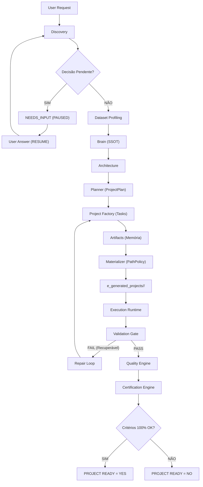
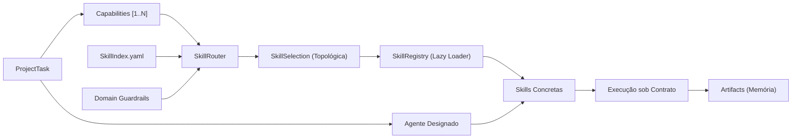
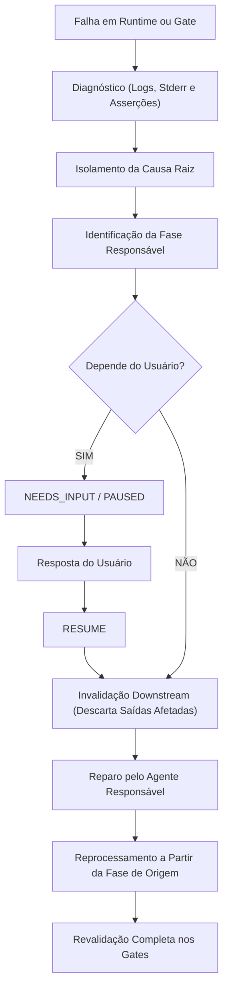
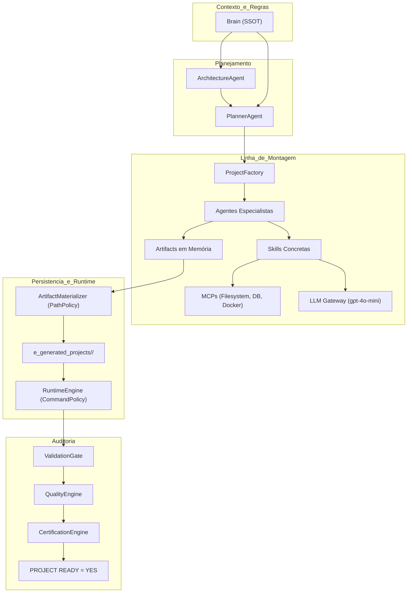

# Analytics Agents Factory (AAF)

> **Plataforma Multiagente Determinística para Engenharia de Dados e Analytics**  
> **Status:** v2.1.0 (Modular Monolith / Homologação de Contratos)  
> **Ambiente de Referência:** macOS (Apple Silicon / MacBook Air M4) e Linux x86_64/ARM64

---

## Visão Geral

O **Analytics Agents Factory (AAF)** é uma plataforma multiagente autônoma e determinística projetada para a **fabricação automatizada de projetos de software completos, executáveis e certificados no espaço de dados**.

Ao receber uma solicitação em linguagem natural — combinada ou não com um dataset bruto —, o AAF não apenas gera trechos isolados de código, mas opera uma verdadeira **linha de montagem de engenharia de software**: descobre requisitos, perfila os dados físicos, extrai regras arquiteturais do seu subsistema de conhecimento (*Brain*), decompõe a entrega em um grafo acíclico de tarefas (*Task DAG*), atribui agentes especialistas, roteia habilidades (*Skills*), materializa os arquivos em disco, executa o projeto gerado em runtime seguro e audita o resultado através de sucessivos portões de validação, qualidade e certificação.

O encerramento com sucesso só ocorre quando o selo formal **`PROJECT READY = YES`** é emitido com base em evidências físicas irrefutáveis.

---

## O Problema

O desenvolvimento tradicional de pipelines de dados e projetos analíticos enfrenta gargalos crônicos:
1. **Trabalho braçal repetitivo:** Configuração recorrente de ambientes, criação de estruturas de pastas, boilerplates de ETL/ELT e schemas dimensionais;
2. **Falta de governança arquitetural:** Padrões heterogêneos de código, ausência de linters unificados e falta de governança sobre dialetos SQL;
3. **Alucinação e presunção de dados:** Modelos generativos tradicionais tendem a inventar colunas, schemas e regras de negócio quando não há barramentos rígidos de contexto e profiling de dados reais;
4. **Ausência de validação pré-entrega:** Códigos gerados por LLMs que parecem sintaticamente corretos, mas falham na primeira execução por incompatibilidade de tipos, caminhos errados ou bibliotecas ausentes.

O AAF resolve esse cenário transformando a geração de código em uma **fábrica governada por contratos tipados**, onde nenhum software é entregue sem passar por compilação, execução real e auditoria automatizada.

---

## Objetivo

O objetivo do AAF é entregar projetos analíticos funcionais, testados e prontos para uso em produção ou análise, garantindo que o status `PROJECT READY = YES` seja uma consequência matemática de evidências de engenharia coletadas no runtime, eliminando intervenções manuais para corrigir defeitos de fabricação.

---

## Escopo

O AAF é hiperespecializado tecnicamente nas disciplinas fundamentais do ecossistema de dados:
- **Data Engineering:** Ingestão de dados estruturados/semiestruturados, pipelines ETL/ELT determinísticos, observabilidade e linhagem;
- **Analytics Engineering:** Modelagem dimensional (Star Schema / Snowflake), modelagem em camadas modulares (raw, staging, intermediate, marts), views e agregações analíticas;
- **Analytics & EDA:** Análise exploratória descritiva, correlações, cálculo de KPIs e métricas de negócio, relatórios estatísticos e visualizações;
- **SQL Analítico:** Criação de schemas DDL, CTEs, window functions e otimização de consultas (PostgreSQL, DuckDB, SQLite);
- **Qualidade e Testes:** Asserções de integridade de dados, testes automatizados unitários via `pytest`, análise estática (`bandit`, `flake8`/`ruff`) e auditoria de dependências (`pip check`);
- **Documentação Automatizada:** Geração de `README.md` oficial de reprodução, dicionários de dados e especificações arquiteturais.

---

## O que o AAF Faz

- Recebe intenções em linguagem natural via CLI ou chat da IDE;
- Inspeciona dados reais em disco via Pandas/DuckDB sem alucinações;
- Formula decisões técnicas baseadas em regras consolidadas no Brain;
- Constrói planos de tarefas estruturados com dependências acíclicas;
- Roteia múltiplas skills por tarefa com deduplicação e ordenação topológica;
- Executa código sob demanda usando carregamento progressivo (*Lazy Loading*);
- Grava os arquivos exclusivamente no diretório isolado do projeto;
- Executa o projeto gerado em subprocesso seguro (`shell=False`, timeout de 120s);
- Submete a entrega a três gates rigorosos: Validação, Qualidade e Certificação;
- Aciona diagnóstico de causa raiz e auto-recuperação (*Repair Loop*) perante falhas;
- Entrega uma aplicação completa, executável e documentada.

---

## O que o AAF NÃO Faz

- **NÃO inventa regras de negócio:** O AAF é rigorosamente agnóstico ao domínio do usuário (vendas, finanças, saúde, logística, etc.). As regras derivam exclusivamente da solicitação e dos dados fornecidos;
- **NÃO gera aplicações web full-stack genéricas:** Não é gerador de e-commerce, blogs, portais sociais ou sistemas transacionais OLTP de alta concorrência;
- **NÃO cria microserviços distribuídos por padrão:** O padrão arquitetural absoluto é **Modular Monolith**;
- **NÃO alucina fontes e destinos críticos:** Não inventa credenciais corporativas fictícias nem conecta a bancos remotos não declarados;
- **NÃO gera código cosmético ou placeholders:** Proibido uso de `pass`, `# TODO` ou mocks permanentes como substitutos de implementação real;
- **NÃO aceita sucesso artificial (*fake success*):** Nenhum gate concede aprovação sem logs físicos e código de saída zero comprovados.

---

## Estado Atual e Contrato Alvo

A tabela abaixo estabelece com transparência a fronteira entre a especificação arquitetural ideal e o estado da implementação:

| Componente / Mecanismo | Target Contract (Contrato Alvo) | Current Implementation Status (Estado Atual) |
|---|---|---|
| **Padrão Arquitetural** | Monolito Modular desacoplado com contratos Pydantic imutáveis. | Implementado integralmente em `a_platform/b_contracts/`. |
| **Roteamento de Skills** | Multi-skill selection (1..N) com deduplicação, ordenação topológica por dependências e lazy loading. | Implementado e operacional em `SkillRouter`, `SkillIndex` e `SkillRegistry`. |
| **Sandbox de Execução** | Ambientes containerizados efêmeros descartáveis via Docker MCP. | Implementado via subprocesso seguro com `shell=False` e `CommandPolicy`. |
| **Ciclo de Reparo** | Diagnóstico transversal de causa raiz com rollback dinâmico para qualquer fase de origem (Discovery, Architecture, Planner ou Factory). | Implementado no `RepairLoop` entre `ValidationGate` e `RuntimeEngine` (até 3 tentativas); o loop transversal entre fases precede o contrato alvo da esteira. |
| **Sessão Interativa** | Pausa e retomada (`NEEDS_INPUT / PAUSED / RESUME`) em qualquer interface com checkpoints JSON. | Implementado no `StateManager` (`h_runtime/state/<project_id>.json`) e na CLI `aaf start`. |
| **Testes da Plataforma** | Suíte completa com cobertura > 85% e testes E2E totalmente automatizados. | Testes unitários essenciais ativos em `c_tests/b_unit/`; suíte E2E em consolidação. |

---

## Contrato Funcional

O Contrato Funcional Oficial do AAF é a definição normativa máxima que rege todo o sistema:

> *"O AAF recebe uma solicitação em linguagem natural, descobre e estrutura os requisitos, analisa os dados disponíveis quando aplicável, consolida o contexto no Brain, define a arquitetura, cria um ProjectPlan, decompõe o projeto em Tasks e Capabilities, atribui os Agents responsáveis, seleciona as Skills necessárias, estabelece a ordem e as dependências de execução, gera os Artifacts, materializa o projeto, executa o projeto realmente gerado e o conduz sequencialmente pelos gates de Validation, Quality e Certification. Quando uma falha recuperável ocorre, o AAF diagnostica a causa raiz, identifica a fase responsável, invalida os resultados posteriores afetados, retorna à fase responsável, corrige e reprocessa o fluxo. Quando uma decisão indispensável depende do usuário, o AAF entra em NEEDS_INPUT/PAUSED e continua após a resposta. O encerramento normal da fabricação ocorre somente quando todos os critérios de prontidão forem satisfeitos e PROJECT READY = YES, quando então o projeto funcional é entregue ao usuário."*

---

## Golden Path

O fluxo oficial segue estritamente a sequência canônica abaixo. Cada fase só é liberada se todos os critérios da anterior forem atendidos.

### Diagrama 1: Golden Path Completo



---

## Como uma Solicitação Vira um Projeto

1. **Recepção:** O usuário submete o objetivo via CLI (`aaf start`) ou interface integrada;
2. **Discovery & Profiling:** O `DiscoveryAgent` estrutura os requisitos (máximo de 5 perguntas, 1 por vez); o `DatasetProfilingSkill` audita estatísticas físicas do arquivo real;
3. **Decisão Arquitetural:** O `ArchitectureAgent` consulta as regras em `a_platform/c_brain/b_rules/` e define a stack (Modular Monolith, Python, SQLite/DuckDB, pytest);
4. **Decomposição em Tarefas:** O `PlannerAgent` monta o `ProjectPlan` com DAG de tarefas, comandos de validação e preflight de segurança;
5. **Fabricação e Roteamento:** A `ProjectFactory` despacha cada tarefa para o agente especialista, que resolve as capabilities através do `SkillRouter` e emite artefatos em memória;
6. **Materialização em Disco:** O `ArtifactMaterializer` grava fisicamente os arquivos sob `e_generated_projects/<project_id>/` aplicando a `PathPolicy`;
7. **Execução no Runtime:** O `RuntimeEngine` executa scripts e testes via subprocesso isolado com `shell=False`;
8. **Tríade de Auditoria:** `ValidationGate` confere compilação estática (`py_compile`) e arquivos; `QualityEngine` audita pytest e linters; `CertificationEngine` emite o laudo final;
9. **Entrega:** Atribuição do selo `PROJECT READY = YES` e disponibilização do projeto compilado.

---

## Project, Task e Capability

A plataforma estabelece hierarquia e cardinalidade estritas:

```text
1 Project ────► 1..N Tasks
1 Task    ────► 1..N Capabilities
1 Task    ────► 1 Agente Responsável
1 Task    ────► 1..N Skills (resolvidas dinamicamente)
```

- **Project:** Unidade macro solicitada pelo usuário (o produto final);
- **Task:** Unidade elementar de planejamento no DAG, associada a exatamente um agente dono;
- **Capability:** Necessidade técnica formal requerida pela tarefa (ex: `data-cleaning`, `sql-analytics`).

### Diagrama 2: Execução de Tarefa e Roteamento de Skills



---

## Agents

Os agentes nativos (`a_platform/g_agents/`) são especialistas funcionais instanciados sob demanda pela `AgentFactory`:

- **Agentes Core (Fluxo Geral Obrigatório):**
  - `DiscoveryAgent`: Elicitação de requisitos, interface de dúvidas (`Q-NN`) e premissas (`assumptions`);
  - `ArchitectureAgent`: Desenho técnico e seleção de padrões arquiteturais;
  - `PlannerAgent`: Decomposição em `ProjectPlan`, resolução de dependências e preflight de comandos;
  - `DataAgent`: Ingestão de dados, profiling, limpeza (`data-cleaning`) e pipelines ETL;
  - `DatabaseAgent`: Modelagem dimensional (Star Schema), schemas DDL e queries analíticas;
  - `AnalyticsAgent`: Agregações analíticas, cálculo de KPIs e exploração de dados (EDA);
  - `TestingAgent`: Construção e execução da suíte de testes unitários com `pytest`;
  - `DocumentationAgent`: Criação de manifestos técnicos, dicionários de dados e `README.md` de execução.
- **Agentes Condicionais (Sob Demanda Explícita):**
  - `BackendAgent`: Exposição de APIs REST (FastAPI);
  - `FrontendAgent`: Construção de interfaces gráficas analíticas (Streamlit/Dash);
  - `ChatbotAgent`: Interfaces conversacionais baseadas em dados;
  - `InfrastructureAgent`: Configurações avançadas de infraestrutura.

---

## Skills

As **Skills** (`a_platform/e_skills/`) são módulos funcionais atômicos e reutilizáveis regidos pelo contrato `SkillContract` (`validate_input → execute → validate_output`):

1. **SkillIndex (`skill_index.yaml`):** Catálogo leve de metadados contendo identificadores, capabilities atendidas, agentes permitidos (`allowed_agents`) e dependências (`depends_on`);
2. **SkillRouter (`skill_router.py`):** Roteador determinístico que resolve capabilities, deduplica skills e ordena topologicamente;
3. **SkillRegistry (`skill_registry.py`):** Despachante que realiza **Lazy Loading** (carrega código e prompts exclusivamente no instante milimétrico de execução da skill);
4. **Progressive Disclosure:** Proibido carregar o código de todas as skills no contexto; apenas metadados compactos trafegam pelo planejamento.

---

## Brain

O **Brain** (`a_platform/c_brain/`) é a **Fonte Única da Verdade (SSOT)** operacional da plataforma:
- **`a_context/`:** Baseline operacional e escopo analítico;
- **`b_rules/`:** Regras normativas de engenharia (`c_architecture_rules.md`, `d_data_rules.md`, `e_sql_rules.md`, etc.);
- **`c_patterns/`:** Padrões consolidados de código (ETL, queries analíticas, Dockerfile);
- **`d_domains/`:** Domínios homologados (`b_domains.yaml`) e skills autorizadas (`allowed_skills`);
- **`e_decisions/`:** Registro formal de decisões arquiteturais históricas (ADRs).

*Nota Arquitetural:* O módulo experimental `h_learning_engine.py` encontra-se fora do Golden Path oficial.

---

## MCPs (Model Context Protocol)

Os **MCPs** (`a_platform/f_mcps/`) são os barramentos seguros de I/O da fábrica:
- **Filesystem MCP (`a_filesystem/`):** Leitura e escrita restrita à sandbox de caminhos (`is_safe_path`);
- **Database MCP (`b_database/`):** Execução de DDL/DML em bancos locais SQLite do projeto gerado, bloqueando comandos externos perigosos (`ATTACH`, `DETACH`);
- **Docker MCP (`c_docker/`):** Gerenciamento seguro de containers sob whitelist restrita e divisão de argumentos em lista;
- **MCPExecutor (`d_registry/b_executor.py`):** Fachada centralizada para telemetria, auditoria e captura de erros.

*Regra Estrita:* MCP é barramento de acesso; não decide arquitetura, não substitui Skills e não contém regras de negócio.

---

## LLM Gateway

O **LLM Gateway** (`a_platform/j_llm_gateway/`) isola a plataforma de dependências externas de inteligência artificial:
- **Abstração Total:** Proibido importar SDKs (`openai`, `anthropic`, etc.) diretamente em agentes ou skills;
- **Provedor Homologado:** Implementado via `OpenAIProvider` (`gpt-4o-mini`), com chave via `OPENAI_API_KEY`;
- **Respostas Tipadas:** Converte retornos de API na classe canônica `LLMResponse`;
- **Falha Antecipada:** Se a chave de API estiver ausente ou inválida, falha imediatamente impedindo a geração de dados fictícios.

---

## Project Factory

A **Project Factory** (`a_platform/h_factory/a_project_factory.py`) consome o `ProjectPlan`, mantém o `GenerationContext`, aciona os agentes especialistas em memória e agrega todos os artefatos de código produzidos. Aplica validação *fail-fast*: se uma tarefa não gerar seus arquivos obrigatórios, o pipeline é interrompido para diagnóstico.

---

## Artifacts e Materializer

- **Artifact (`a_platform/b_contracts/g_artifact.py`):** Objeto tipado em memória representando cada arquivo do projeto (`path`, `type`, `content`, `producer`, `metadata`);
- **ArtifactMaterializer (`a_platform/i_materializer/a_materializer.py`):** Converte a lista de artefatos em arquivos físicos no disco;
- **PathPolicy (`b_path_policy.py`):** Sandbox obrigatória que previne path traversal (`..`) e restringe a gravação estritamente a `e_generated_projects/<project_id>/`.

---

## Runtime

O **ProjectRuntime** (`a_platform/k_runtime/a_execution/a_runtime.py`) executa fisicamente os comandos do projeto materializado:
- Opera via `subprocess.Popen` com `shell=False` compulsório;
- Argumentos fornecidos como lista sanitizada (`List[str]`);
- Timeout rígido padrão de 120 segundos;
- Captura de evidências físicas completas em `CommandExecutionResult` (`return_code`, `stdout`, `stderr`, duração).

---

## Validation, Quality e Certification

A esteira de auditoria opera em sequência linear irreversível:

1. **ValidationGate (`a_platform/l_validation/`):**  
   - `ProjectValidation`: ID e plano válidos, materialização com status `SUCCESS`;  
   - `StructureValidation`: Arquivos existentes no disco, tamanho > 0 e **compilação estática de sintaxe Python via `py_compile`**;  
   - `ExecutionValidation`: Código de retorno do runtime estritamente 0 e ausência de timeouts.
2. **QualityEngine (`a_platform/m_quality/`):**  
   - Avalia quatro dimensões: `Tests` (execução real do `pytest`), `Security` (análise estática via `bandit`), `Code Quality` (linters `flake8`/`ruff`) e `Dependencies` (`pip check`);  
   - Aprovação exige score ponderado $\ge 0.75$ com nota eliminatória $1.0$ em Segurança e Testes.
3. **CertificationEngine (`a_platform/n_certification/`):**  
   - Auditoria final cruzada de toda a cadeia de custódia das evidências;  
   - Emite laudo oficial de aprovação e autoriza a concessão de prontidão.

---

## Repair e Recovery

Falhas de execução ou reprovações em gates acionam o **Repair Contract Oficial**:

### Diagrama 3: Fluxo Oficial de Reparo



- **Invalidação a Jusante:** Todos os artefatos e laudos dependentes da fase corrigida são formalmente descartados;
- **Limite de Tentativas:** Auto-recuperação limitada a **3 tentativas** (`max_repair_attempts = 3`);
- **Proibição de Desistência Passiva:** Proibido adotar `FAIL → PROJECT READY = NO → FIM` sem antes esgotar o ciclo de diagnóstico e reparo.

---

## PROJECT READY

O status **`PROJECT READY = YES`** é o selo oficial de excelência de engenharia do AAF, concedido apenas perante a conjunção estrita:

$$\text{Discovery = COMPLETE} \land \text{Planning = COMPLETE} \land \text{Materialization = SUCCESS} \land \text{Execution = PASSED} \land \text{Validation = PASSED} \land \text{Quality = PASSED}$$

Se qualquer gate não emitir laudo favorável ou se faltarem evidências físicas, o projeto permanece provisoriamente em `PROJECT READY = NO` (estado transitório de "ainda não pronto").

---

## Arquitetura

### Diagrama 4: Topologia de Componentes e Responsabilidades



---

## Fontes de Verdade

A governança do repositório consagra as seguintes referências canônicas:

| Domínio de Conhecimento | Fonte da Verdade Oficial (SSOT) | Localização no Código |
|---|---|---|
| **Requisitos da Execução** | `DiscoveryAgent` e `ExecutionContext` | `a_platform/b_contracts/i_execution_context.py` |
| **Contexto e Regras** | Subsistema Brain | `a_platform/c_brain/` (`g_brain.py` e `b_rules/`) |
| **Arquitetura do Projeto** | `ArchitectureDecision` | `a_platform/b_contracts/` e `g_agents/c_architecture/` |
| **Plano de Tarefas** | `ProjectPlan` | `a_platform/b_contracts/f_plan.py` |
| **Definição de Tarefas** | `ProjectTask` | `a_platform/b_contracts/e_task.py` |
| **Capabilities da Tarefa** | Declaração na Task e `ProjectPlan` | `a_platform/b_contracts/e_task.py` |
| **Skills Disponíveis** | Catálogo `SkillIndex` | `a_platform/e_skills/skill_index.yaml` |
| **Implementação de Skills** | `SkillRegistry` e `SkillContract` | `a_platform/e_skills/skill_registry.py` |
| **Agentes Disponíveis** | `AgentRegistry` e `AgentFactory` | `a_platform/g_agents/n_factory/a_agent_factory.py` |
| **Acesso Operacional** | `MCPRegistry` e `MCPExecutor` | `a_platform/f_mcps/d_registry/` |
| **Modelos de Linguagem** | `LLMGateway` e Configurações | `a_platform/j_llm_gateway/` e `g_configuration/` |
| **Artefatos em Memória** | Contrato `Artifact` e `GenerationContext`| `a_platform/b_contracts/g_artifact.py` |
| **Projeto Físico em Disco**| `ArtifactMaterializer` e `PathPolicy` | `e_generated_projects/<project_id>/` |
| **Evidências de Execução** | `CommandExecutionResult` e `ExecutionResult`| `a_platform/b_contracts/h_execution.py` |
| **Laudo de Validação** | `ValidationResult` (`ValidationGate`) | `a_platform/l_validation/` |
| **Laudo de Qualidade** | `QualityResult` (`QualityEngine`) | `a_platform/m_quality/` |
| **Laudo de Certificação** | `CertificationResult` (`CertificationEngine`)| `a_platform/n_certification/` |
| **Selo de Prontidão** | Contrato de Readiness | `request.metadata["PROJECT_READY"] = "YES"` |
| **Estado de Sessão** | `StateManager` (Checkpoints JSON) | `h_runtime/state/<project_id>.json` |
| **Visualização Humana** | Workspace e Grafo Obsidian | `.obsidian/` (passivo, não participa do runtime) |

---

## Estrutura do Repositório

```text
analytics_agents_factory/
├── .agents/                        # Diretrizes e contrato normativo da IDE (a_AGENT.md)
├── .obsidian/                      # Configurações do workspace visual Obsidian
├── a_platform/                     # Núcleo modular da plataforma AAF
│   ├── b_contracts/                # Contratos Pydantic e modelos tipados
│   ├── c_brain/                    # SSOT de conhecimento, regras, domínios e decisões
│   ├── e_skills/                   # Catálogo, índice, roteador e execução de Skills
│   ├── f_mcps/                     # Protocolos seguros de I/O (Filesystem, Database, Docker)
│   ├── g_agents/                   # Agentes de orquestração e agentes especialistas
│   ├── h_factory/                  # Orquestração em memória de geração de artefatos
│   ├── i_materializer/             # Persistência atômica no disco e PathPolicy
│   ├── j_llm_gateway/              # Abstração de modelos e provedor OpenAI
│   ├── k_runtime/                  # Execution Runtime seguro e CommandPolicy
│   ├── l_validation/               # Gates de validação estrutural, de sintaxe e de execução
│   ├── m_quality/                  # Avaliação ponderada de testes, segurança e linters
│   ├── n_certification/            # Motor conclusivo de auditoria de prontidão
│   └── o_orchestration/            # MasterOrchestrator e RepairLoop
├── b_input/                        # Diretório de entrada para datasets analíticos
├── c_tests/                        # Suíte de testes da plataforma AAF (unit, int, val, e2e)
├── d_documentation/                # Documentação técnica e funcional oficial
│   ├── a_documentation_functional/ # Manuais funcionais da esteira
│   └── b_documentation_technical/  # Especificações de arquitetura e implementação
├── e_generated_projects/           # Diretório reservado para gravação dos projetos gerados
├── f_cli/                          # Interface de linha de comando oficial (a_main.py)
├── g_configuration/                # Configurações globais e carregamento de .env
├── h_runtime/                      # Estado de sessão persistente
│   └── state/                      # Checkpoints JSON de sessões (<project_id>.json)
├── .env.example                    # Modelo de configuração de variáveis de ambiente
├── .gitignore                      # Regras de exclusão de artefatos e caches
├── Dockerfile                      # Manifest de containerização da plataforma
├── docker-compose.yml              # Composição para execução de serviços
├── README.md                       # Porta de entrada oficial do repositório
└── requirements.txt                # Dependências Python obrigatórias da plataforma
```

---

## Pré-requisitos

Para executar o AAF em ambiente macOS (Apple Silicon / MacBook Air M4) ou Linux:
- **Python:** 3.10, 3.11 ou 3.12 (recomendado Python 3.11 ou superior);
- **Chave de API:** Chave ativa da OpenAI (`OPENAI_API_KEY`) para o modelo padrão `gpt-4o-mini`;
- **Docker:** Opcional para o modo de execução padrão via subprocesso local; obrigatório caso utilize o container da plataforma.

---

## Instalação no macOS

Passo a passo testado e adaptado para terminal zsh no macOS Apple Silicon:

```bash
# 1. Verificar a versão do Python instalado
python3 --version

# 2. Criar ambiente virtual isolado (.venv)
python3 -m venv .venv

# 3. Ativar o ambiente virtual
source .venv/bin/activate

# 4. Atualizar o gerenciador de pacotes pip
python3 -m pip install --upgrade pip

# 5. Instalar as dependências oficiais da plataforma
python3 -m pip install -r requirements.txt
```

---

## Configuração

A plataforma carrega automaticamente suas configurações a partir de variáveis de ambiente gerenciadas por `g_configuration/a_settings.py` via `pydantic-settings`.

Crie o seu arquivo `.env` local a partir do modelo `.env.example`:

```bash
cp .env.example .env
```

---

## Variáveis de Ambiente

| Variável | Tipo | Padrão | Obrigatória? | Descrição |
|---|---|---|---|---|
| `OPENAI_API_KEY` | String | `""` | **Sim** | Chave de autenticação da API OpenAI. |
| `LLM_PROVIDER` | String | `"openai"` | Não | Provedor primário de inferência (`openai`). |
| `LLM_MODEL` | String | `"gpt-4o-mini"` | Não | Modelo de referência para geração analítica. |
| `MAX_REPAIR_ATTEMPTS` | Inteiro | `3` | Não | Limite máximo de tentativas automáticas do Repair Loop. |
| `PROJECT_OUTPUT_DIR` | String | `e_generated_projects` | Não | Caminho base absoluto ou relativo para persistência física. |

---

## CLI

A CLI oficial reside em `f_cli/a_main.py`. Ela expõe cinco comandos fundamentais:

```bash
# Iniciar novo projeto ou responder sessão pausada
python3 f_cli/a_main.py start --project-id <id> --prompt "<prompt>" [--dataset <path>] [--answer "<resposta>"]

# Consultar o status da máquina de estados de uma sessão
python3 f_cli/a_main.py status <project_id>

# Inspecionar o laudo de prontidão e caminhos de um projeto concluído
python3 f_cli/a_main.py result <project_id>

# Listar as regras, padrões e domínios ativos no Brain
python3 f_cli/a_main.py brain

# Listar os MCPs operacionais registrados e suas capacidades
python3 f_cli/a_main.py mcp
```

---

## Executando do Zero

Exemplo de sessão completa para fabricação de um projeto de ETL e Analytics:

```bash
# Ativar o ambiente virtual
source .venv/bin/activate

# Iniciar a fabricação do projeto
python3 f_cli/a_main.py start \
  --project-id "vendas_analytics" \
  --prompt "Construir pipeline ETL para ingestão de dados de vendas, limpeza de registros nulos, agregação de faturamento mensal e persistência em banco SQLite com testes unitários pytest" \
  --dataset "./b_input/c_dados_vendas.csv"
```

Se o `DiscoveryAgent` identificar uma decisão indispensável, o terminal exibirá:
```text
=======================================================
[AAF Discovery] PAUSED - Aguardando Resposta do Usuário
Projeto ID: vendas_analytics
Pergunta:
Qual a regra de agregação para notas com status cancelado?
=======================================================
Para responder, execute: aaf start --project-id vendas_analytics --answer "<sua resposta>"
```

Para responder e retomar:
```bash
python3 f_cli/a_main.py start \
  --project-id "vendas_analytics" \
  --answer "Desconsiderar notas com status cancelado do faturamento"
```

Ao término com aprovação unânime de todos os gates, a CLI conclui:
```text
=======================================================
🏆 PROJECT READY = YES (vendas_analytics)
=======================================================
```

---

## Entradas Aceitas

- **Prompts textuais:** Objetivos analíticos em português ou inglês descrevendo pipelines, transformações, agregações, modelagens dimensionais e requisitos de qualidade;
- **Datasets estruturados:** Arquivos CSV, JSON, Parquet posicionados em `b_input/` ou acessíveis via caminho absoluto em disco;
- **Respostas de continuação:** Esclarecimentos pontuais submetidos via flag `--answer` para destravar sessões pausadas.

---

## Saídas Produzidas

Todo projeto aprovado com `PROJECT READY = YES` é materializado de forma autocontida em:
```text
e_generated_projects/<project_id>/
├── README.md               # Guia de instalação, testes e execução do projeto
├── requirements.txt        # Dependências pinadas da solução analítica
├── sql/
│   └── schema.sql          # Schemas DDL e views dimensionais
├── src/
│   ├── ingestion.py        # Módulo de ingestão e sanitização
│   ├── pipeline.py         # Pipeline de dados e transformações
│   └── analytics.py        # Consultas de métricas e agregações
├── tests/
│   └── test_pipeline.py    # Testes unitários com pytest
└── data/                   # Diretório de persistência do banco local SQLite
```

---

## Exemplo Ponta a Ponta

> **Nota de Transparência:** Este exemplo descreve o **comportamento de uso esperado** da plataforma conforme homologado no contrato funcional. A execução física completa do pipeline E2E depende de conectividade com a API da OpenAI e chaves ativas.

1. **Entrada do Usuário:**
   - Prompt: *"Criar pipeline para ler dados de vendas, tratar duplicatas e calcular o total vendido por região, salvando no SQLite e gerando testes pytest."*
   - Dataset: `./b_input/c_dados_vendas.csv` (contendo colunas `id_venda`, `data`, `regiao`, `valor`).
2. **Ciclo Interno:**
   - Discovery extrai o domínio `analytics`;
   - Profiling mede 1.000 linhas, 4 colunas, tipos inferidos e zero nulos;
   - Brain injeta regras de Modular Monolith e SQL parametrizado;
   - Planner agenda 4 tarefas: Schema DDL, Ingestão/Limpeza, Agregações, Testes;
   - Factory aciona `DatabaseAgent`, `DataAgent`, `AnalyticsAgent` e `TestingAgent`;
   - Materializer persiste os arquivos em `e_generated_projects/demo_vendas/`;
   - Runtime executa `python -m pytest tests/` com saída 100% aprovada;
   - ValidationGate valida sintaxe com `py_compile`;
   - QualityEngine pontua score 1.0 em segurança e testes;
   - CertificationEngine emite selo de conformidade.
3. **Resultado:**
   - Projeto pronto para uso entregue ao usuário sob `e_generated_projects/demo_vendas/`.

---

## Resultado Esperado

Ao concluir a fabricação, o usuário obtém um projeto que:
- Não requer correções manuais de código para iniciar;
- Contém dependências declaradas e compatíveis;
- Possui suíte de testes passando localmente com `pytest`;
- Respeita os tipos e o schema dos dados brutos informados.

---

## Como Verificar o Resultado

Para inspecionar o status e a entrega do projeto gerado:

```bash
# 1. Checar o laudo executivo da fabricação
python3 f_cli/a_main.py result vendas_analytics

# 2. Navegar até o projeto gerado
cd e_generated_projects/vendas_analytics

# 3. Inspecionar os arquivos produzidos
ls -la

# 4. Executar os testes unitários do projeto entregue
python3 -m pytest tests/
```

---

## Testes da Plataforma AAF

A plataforma AAF possui sua própria suíte de testes de engenharia em `c_tests/`:
- **`c_tests/b_unit/`:** Valida contratos Pydantic, serialização do StateManager, roteamento do SkillRouter e políticas de segurança;
- **`c_tests/c_integration/`:** Valida despacho de tarefas entre fábrica e agentes;
- **`c_tests/d_validation/`:** Valida a detecção de anomalias por cada gate;
- **`c_tests/e_end_to_end/`:** Valida a esteira completa ponta a ponta.

Para executar os testes unitários da plataforma em momentos apropriados de desenvolvimento:
```bash
# Executar testes unitários com PYTHONPATH configurado
PYTHONPATH=. .venv/bin/pytest c_tests/b_unit/
```

---

## Diagnóstico e Troubleshooting

| Sintoma Observado | Causa Mais Provável | Ação Corretiva Recomendada |
|---|---|---|
| `command not found: python` | Ambiente virtual não ativado no terminal. | Execute `source .venv/bin/activate`. |
| `LLMException: Chave ausente` | Variável `OPENAI_API_KEY` não configurada. | Adicione sua chave válida no arquivo `.env` local. |
| `NEEDS_INPUT / PAUSED` | O Discovery detectou dúvida indispensável. | Responda com `python3 f_cli/a_main.py start --project-id <id> --answer "<sua resposta>"`. |
| `PathPolicyViolationError` | Tentativa de escrita de arquivo fora de `e_generated_projects/`. | Inspecione o caminho declarado no artefato produzido pela tarefa. |
| `CommandPolicyViolationError` | Tentativa de executar comando com `shell=True` ou binário não listado. | Ajuste os `run_commands` no planejamento para utilizar binários da whitelist. |
| `ValidationGate: FAILED (SyntaxError)` | Código Python gerado com erro de sintaxe. | Acione o `RepairLoop` para regenerar o artefato ou revise o prompt do agente especialista. |
| `QualityEngine: Tests FAILED` | Falha na execução do `pytest` no projeto gerado. | Inspecione o `stderr` do `ExecutionResult` para isolar a asserção que quebrou. |
| `PROJECT READY = NO` | Algum gate anterior não foi aprovado com evidência real. | Execute `python3 f_cli/a_main.py result <id>` para identificar qual gate rejeitou a entrega. |

*Alerta de Governança:* Jamais edite manualmente os arquivos gerados em `e_generated_projects/` durante o pipeline para disfarçar erros da fábrica. Se a automação falhou, a causa raiz na plataforma deve ser corrigida.

---

## Session State

A persistência do ciclo de vida das sessões da fábrica é mantida em arquivos JSON dedicados em:
```text
h_runtime/state/<project_id>.json
```
- Gerenciada pelo `StateManager` (`a_platform/b_contracts/j_state_manager.py`);
- Garante idempotência: se o terminal for fechado, o progresso validado não é perdido;
- A execução pode ser retomada com o mesmo `--project-id` a qualquer momento.

---

## Segurança

- **Sandbox de Caminhos:** Restrição física estrita a `e_generated_projects/` via `PathPolicy`;
- **Sandbox de Comandos:** Comandos executados via subprocesso com `shell=False`, sem interpolação de shell e restritos a binários auditados (`CommandPolicy`);
- **Isolamento de Segredos:** Credenciais residem exclusivamente no `.env` e são lidas por `AAFSettings`. Logs de auditoria são limpos contra vazamento de tokens;
- **Sandbox de Banco:** O `DatabaseMCP` rejeita comandos de extensão ou contaminação externa (`ATTACH`/`DETACH`).

---

## Guardrails

1. **Domain Guardrails (`allowed_skills`):** Agentes e tarefas só executam skills autorizadas para o domínio configurado em `b_domains.yaml`;
2. **Agent Guardrails (`allowed_agents`):** Skills só podem ser invocadas por agentes listados em seus metadados no `skill_index.yaml`;
3. **Gate Integrity:** Proibido avançar de fase sem status comprovado da fase precedente;
4. **Sem Fallback Silencioso:** Proibido capturar exceções sem tratamento e mascarar erros como sucesso.

---

## Como Evoluir o AAF

Para desenvolvedores e agentes da IDE que forem alterar a plataforma AAF, siga o checklist de disciplina de engenharia:

1. **Identificar o Contrato:** Localize o modelo em `a_platform/b_contracts/`;
2. **Inspeção Dupla:** Inspecione tanto quem **produz** o dado quanto todos os **consumidores** existentes antes de alterar qualquer assinatura;
3. **Consultar o Brain:** Verifique se a mudança respeita as regras de domínio e arquitetura em `a_platform/c_brain/b_rules/`;
4. **Preservar a Tipagem:** Não troque contratos Pydantic por dicionários soltos;
5. **Atualizar a Documentação:** Reflita mudanças estruturais nos documentos canônicos em `d_documentation/`;
6. **Validar em Camadas:** Valide unitariamente antes de propor execuções integradas.

---

## Documentação Aprofundada

A plataforma conta com documentação completa organizada em duas categorias estruturadas:

- **Jornada Funcional (`d_documentation/a_documentation_functional/`):**
  - [[a_aaf|Visão Geral do AAF]]: Missão, princípios e escopo;
  - [[b_golden_path|Golden Path Oficial]]: Matriz de fases, pré-condições e sequenciamento;
  - [[c_discovery_and_input|Discovery e Entrada de Dados]]: Protocolo de perguntas, assumptions e profiling;
  - [[d_planning_and_decomposition|Planejamento e Decomposição]]: Planejamento por capabilities e DAG de tarefas;
  - [[e_agents_capabilities_and_skills|Agentes, Capabilities e Skills]]: Roteamento multi-skill e lazy loading;
  - [[f_project_generation|Geração de Projetos]]: Project Factory, artefatos e materialização;
  - [[g_execution_and_gates|Execução e Gates]]: Runtime real, evidências e critérios de passagem;
  - [[h_repair_and_recovery|Reparo e Recuperação]]: Diagnóstico de causa raiz e auto-recuperação;
  - [[i_project_ready_and_delivery|Project Ready e Entrega]]: Fórmula de prontidão e pacote final;
  - [[j_operational_use|Uso Operacional]]: Guia completo da CLI oficial.

- **Especificações Técnicas (`d_documentation/b_documentation_technical/`):**
  - [[a_system_architecture|Arquitetura do Sistema]]: Modular Monolith e acoplamento;
  - [[b_contracts_and_state|Contratos e Estado]]: Modelos Pydantic, DTOs e StateManager;
  - [[c_brain_and_context|Brain e Gestão de Contexto]]: SSOT operacional e regras;
  - [[d_planner_and_execution_plan|Planner e Plano de Execução]]: Decomposição e preflight de comandos;
  - [[e_agents_and_skills|Agentes e Skills (Técnico)]]: Hierarquia BaseAgent, SkillRouter e catálogo;
  - [[f_mcps_and_llm_gateway|MCPs e LLM Gateway]]: Abstração de I/O e modelos de IA;
  - [[g_factory_and_materialization|Fábrica e Materialização]]: Orquestração em memória e escritas;
  - [[h_runtime_and_command_policy|Runtime e Política de Comandos]]: Subprocessos seguros e evidências;
  - [[i_validation_quality_certification|Validação, Qualidade e Certificação]]: Detalhamento técnico dos gates;
  - [[j_repair_orchestration|Orquestração de Reparo]]: Arquitetura do motor de reparo no MasterOrchestrator;
  - [[k_security_and_guardrails|Segurança e Guardrails]]: Políticas de sandbox e isolamento;
  - [[l_testing_strategy|Estratégia de Testes]]: Pirâmide de testes e responsabilidades;
  - [[m_obsidian_knowledge_graph|Grafo Obsidian]]: Mapeamento relacional passivo para humanos.

---

## Obsidian

O diretório `.obsidian/` permite abrir a raiz do repositório como um *vault* no aplicativo **Obsidian**.
- **Camada Humana:** O grafo do Obsidian serve exclusivamente para visualização gráfica, navegação semântica e leitura relacional por pessoas;
- **Não Participa do Runtime:** O código da fábrica e os agentes não leem arquivos do `.obsidian/`; o SSOT reside incondicionalmente em `a_platform/c_brain/`.

---

## Limitações Conhecidas

1. **Reparo Transversal entre Fases:** O `RepairLoop` atual opera no ciclo fechado entre `ValidationGate` e `RuntimeEngine` (até 3 tentativas de regeneração). O rollback automático que retroalimenta Architecture ou Planner perante erros conceituais representa o contrato alvo em evolução;
2. **Provedor de LLM:** O provedor padrão ativo e homologado é o `OpenAIProvider` (`gpt-4o-mini`). Provedores alternativos (Anthropic, Gemini) possuem interfaces mapeadas, mas não estão habilitados por padrão nesta versão;
3. **Concorrência:** A esteira opera de forma serial determinística. Paralelização de tarefas independentes do DAG está prevista para versões futuras.

---

## Definition of Ready (DoR)

Uma tarefa ou projeto de fabricação só pode ser iniciado quando:
1. Requisitos técnicos estiverem formalmente estruturados no Brain sem bloqueios de `NEEDS_INPUT`;
2. Contratos de entrada e saída estiverem estritamente definidos em `b_contracts/`;
3. Domínio técnico e guardrails estiverem estabelecidos em `b_domains.yaml`;
4. Se houver dataset físico, o profiling factual tiver sido concluído com evidências registradas.

---

## Definition of Done (DoD)

Uma fabricação só é considerada concluída quando:
1. 100% dos artefatos planejados foram fisicamente gravados no disco sem placeholders (`pass`, `TODO`);
2. O código executou com exit code 0 no Runtime;
3. A suíte de testes unitários do projeto gerado foi executada com 100% de aprovação via `pytest`;
4. Os gates de Validation, Quality e Certification emitiram laudos formais `PASSED`;
5. O selo `PROJECT READY = YES` foi atribuído com base em evidências reais;
6. O projeto funcional encontra-se disponível e documentado em `e_generated_projects/<project_id>/`.

---

## Contribuição

Ao colaborar com a plataforma Analytics Agents Factory:
1. Mantenha a aderência rigorosa à Constituição Operacional da IDE ([`.agents/a_AGENT.md`](file:///.agents/a_AGENT.md));
2. Não realize alterações destrutivas em contratos públicos sem atualizar todos os produtores e consumidores;
3. Nunca commite segredos ou arquivos `.env`;
4. Toda nova funcionalidade deve ser acompanhada de documentação técnica correspondente em `d_documentation/`.

---

**Analytics Agents Factory** — *Engenharia de Software e Dados Determinística Governa por Contratos.*