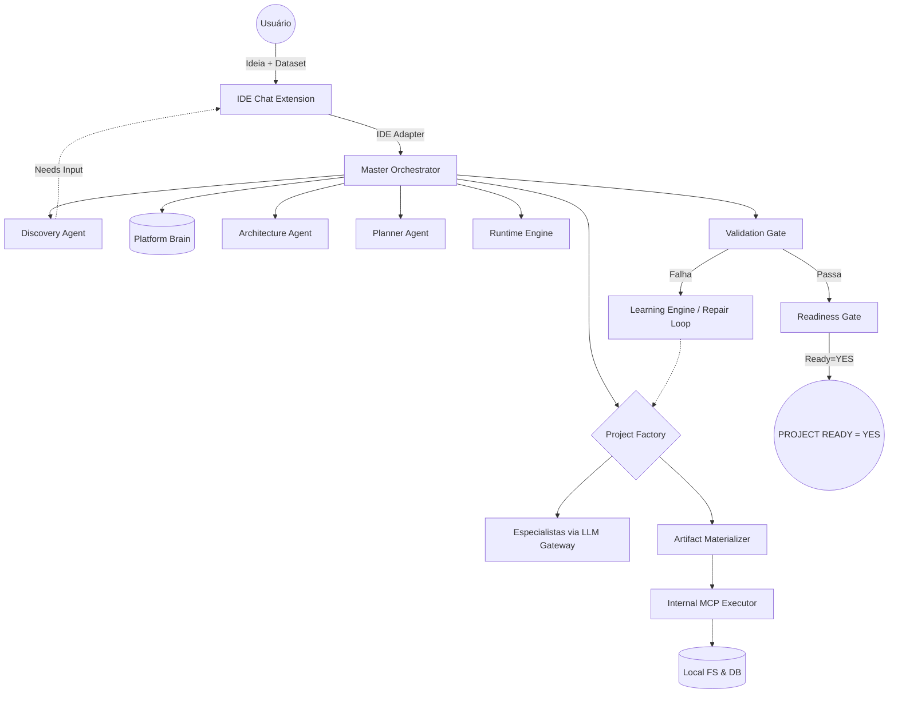

# Analytics AI Factory (AAF) 🏭 v2.0 Real

A Analytics AI Factory é uma plataforma autônoma projetada para criar pipelines de dados, arquiteturas analíticas e web apps de forma end-to-end. Ela não apenas gera o código, mas materializa, valida localmente via MCP, entra em um loop de autocorreção (Repair Loop) e emite um certificado final de prontidão de acordo com a Regra Absoluta do Projeto Pronto.

## 🌟 Visão Geral e Proposta

A AAF substitui a geração de templates estáticos por uma fábrica inteira baseada em Agentes de IA Especialistas. Você entra com um prompt na IDE Chat, o motor infere requisitos, faz perguntas de refinamento iterativas na mesma thread (Discovery), desenha o plano arquitetural, materializa os arquivos Python/SQL e executa testes locais reais (Runtime Engine) para garantir que o projeto funciona!

## 🗺️ Fluxo de Execução E2E (Diagrama de Arquitetura)



## ⚖️ A Regra Absoluta de Certificação
`PROJECT READY = YES` **SOMENTE SE**:
1. Discovery e Planejamento forem completamente aprovados pelo usuário e LLM.
2. A fábrica construir o projeto através de MCP de verdade e os artefatos obrigatórios existirem (`Materialization = SUCCESS`).
3. O código for executado localmente de verdade pelo **RuntimeEngine** sem exceptions.
4. O **ValidationGate** comprovar que o ambiente suporta o código.
5. Se houver falha de execução, o **Repair Loop** usar LLM para patchear arquivos automaticamente até 3 vezes.

## 🚀 Guia de Uso

### Interface Principal: IDE Chat
O AAF 2.0 foi arquitetado para ser uma engine embedded. A principal forma de iteração é acionar o **IDE Adapter** via IDE Chat, que mantém o `project_id` instanciado na pasta `.aaf_state/`, permitindo retomadas e iterações ao longo dos dias.

### Pré-requisitos
- Python 3.10+
- OpenAI API Key, Anthropic API Key ou Google Gemini API Key. (Provedores locais sem fidelity foram removidos para garantir geração confiável de JSON nos fluxos autônomos).

```bash
# Clone e entre no diretório
cd analytics_agents_factory

# Instale dependências core
python -m venv .venv
source .venv/bin/activate
pip install -r requirements.txt
```

### CLI (Terminal)
Caso não esteja usando a IDE, você pode acionar o motor via CLI nativo que emulará a interface de chat se necessário:
```bash
python main.py create "Crie uma API FastAPI de gestão de usuários"
```
Se o Discovery Agent precisar de mais detalhes, o motor persistirá em `.aaf_state/` e solicitará que você utilize o comando `continue`:
```bash
python main.py continue <project_id> "Os usuários devem ter email e senha."
```

## 📂 Estrutura de Diretórios Canônica
- `a_platform/`: O coração do AAF.
  - `a_interfaces/ide/`: IDE Adapter - o portão oficial de entrada (substitui endpoints obsoletos e cli avulsos).
  - `a_core/`: State Manager, Domain Models, Readiness Gate e Master Orchestrator.
  - `b_brain/`: Graph Builder, Backends Obsidian/Graphify, Memory.
  - `c_agents/`: Agentes especialistas (Discovery, Planner, Architecture).
  - `d_skills/`: Funcionalidades plugáveis estritas com validação por Contrato (`SkillContract`).
  - `e_mcp/`: Executores de sistema real (Database SQLite, Git, Filesystem).
  - `f_llm_gateway/`: O provedor único de LLM da plataforma.
  - `g_factory/`: A orquestradora de criação e o Materializador.
  - `i_runtime/`, `j_validation/`, `k_quality/`, `l_certification/`: As catracas da Prova de Fogo.
  - `m_learning/`: Repair loop de correção automatizada em falhas.
- `e_generated_projects/`: Onde seu código pronto, testado e certificado aparece magicamente.
- `.aaf_state/`: Ponto de salvamento dos projetos em andamento.
