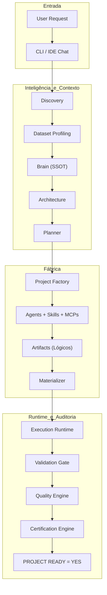

# AAF — Analytics Agents Factory

> **Documentação Funcional Oficial — Visão Geral e Fundamentos**  
> **Status:** Canônico / Normativo  
> **Navegação:** [[b_golden_path|Próximo: Golden Path]]

---

## 1. Definição da Plataforma

O **Analytics Agents Factory (AAF)** é uma plataforma multiagente autônoma e determinística projetada para a fabricação serial de projetos de software completos, executáveis e certificados em engenharia de dados e analytics. 

O AAF opera como um **Modular Monolith** que recebe uma solicitação em linguagem natural e, de forma autônoma e governada, realiza o ciclo completo de engenharia: descobre requisitos, perfila dados reais, consulta conhecimento arquitetural no Brain, planeja tarefas e dependências, coordena agentes especialistas que executam habilidades (*Skills*), materializa arquivos físicos, executa o projeto gerado em runtime seguro e audita a entrega através de gates sucessivos de validação, qualidade e certificação.

---

## 2. O Problema Resolvido

No desenvolvimento tradicional de projetos analíticos e pipelines de dados, observam-se gargalos crônicos:
1. **Trabalho braçal repetitivo:** Criação manual de estruturas de diretórios, configurações de ambiente, scripts básicos de ETL/ELT e schemas dimensionais;
2. **Falta de padronização arquitetural:** Dispersão de padrões de código, ausência de linters unificados e falta de governança sobre queries SQL e dialetos;
3. **Ausência de validação física pré-entrega:** Soluções baseadas puramente em LLMs geram código que parece correto sintaticamente mas falha na execução física por dependências ausentes, schemas incorretos ou tipos corrompidos;
4. **Alucinação de regras e dados:** Modelos generativos tendem a inventar colunas, schemas e regras de negócio não solicitadas quando não há um barramento rígido de contexto e profiling de dados reais.

O AAF resolve esses problemas transformando a geração de software em uma **fábrica determinística de software**, onde cada linha de código gerada é executada, testada e auditada contra evidências reais antes da entrega ao usuário final.

---

## 3. Objetivo

O objetivo primordial do AAF é entregar projetos funcionais e prontos para uso em ambiente de produção ou análise, garantindo que o status **`PROJECT READY = YES`** signifique a aprovação matemática e factual de todos os gates de engenharia.

---

## 4. Especialização Técnica e Agnosticismo de Domínio

### 4.1 Especialização Técnica Estrita
O AAF é tecnicamente hiperespecializado nas seguintes disciplinas:
- **Data Engineering:** Ingestão de dados brutos, pipelines ETL/ELT determinísticos, observabilidade e linhagem;
- **Analytics Engineering:** Modelagem dimensional (Star Schema / Snowflake), modelagem em camadas (staging, intermediate, marts), views analíticas;
- **Analytics & EDA:** Análise exploratória de dados, estatística descritiva, correlações, cálculo de KPIs e métricas de negócio, relatórios e visualizações;
- **SQL Analítico:** Criação de schemas DDL, CTEs, window functions e otimização de consultas analíticas;
- **Qualidade de Dados:** Validação de schemas, detecção de nulos, duplicatas e asserções de completude e integridade;
- **Documentação e Testes:** Testes unitários com pytest, análise estática de código e documentação operacional completa.

### 4.2 Agnosticismo de Domínio de Negócio
O AAF é **completamente agnóstico ao domínio de negócio** ao qual os dados pertencem. A fábrica atende com igual rigor técnico projetos de:
- Vendas e E-commerce;
- Finanças e Contabilidade;
- Saúde e Farmacêutica;
- Recursos Humanos;
- Logística e Supply Chain;
- Marketing e Growth;
- Qualquer outro domínio corporativo.

A plataforma **NÃO inventa regras de negócio** e **NÃO presume métricas não solicitadas**. Todas as regras de negócio provêm estritamente da solicitação do usuário ou de dados reais fornecidos.

---

## 5. Escopo e Fora de Escopo

| Dimensão | No Escopo do AAF | Fora de Escopo do AAF |
|---|---|---|
| **Arquitetura** | Monolitos modulares analíticos, scripts Python estruturados, SQLite/DuckDB/PostgreSQL local. | Microserviços distribuídos, clusters Kubernetes complexos como padrão, arquiteturas event-driven distribuídas no MVP. |
| **Aplicações** | Pipelines de dados, scripts de automação analítica, relatórios, módulos de métricas e dashboards analíticos (Streamlit/Dash sob demanda). | Sistemas web transacionais (CRUD, e-commerce, blogs, redes sociais), APIs OLTP de alta concorrência. |
| **Dados** | Arquivos CSV, JSON, Parquet, bancos relacionais e analíticos locais. | Invenção de conexões corporativas remotas, dados sintéticos não solicitados ou credenciais fictícias. |
| **Geração** | Código completo, executável, documentado e testado fisicamente no Runtime. | Mocks permanentes, placeholders (`pass`, `TODO`), código cosmético que não executa. |

---

## 6. Entradas e Saídas

- **Entradas:**
  1. Solicitação do usuário em linguagem natural (via IDE Chat ou CLI `aaf start`);
  2. Arquivo de dados brutos opcional (CSV, JSON, etc. apontado em `b_input/`).
- **Saídas:**
  1. Diretório completo do projeto materializado em `e_generated_projects/<project_id>/`;
  2. Código-fonte executável, documentação (README.md, dicionário de dados) e suíte de testes (`tests/`);
  3. Relatório de certificação auditado com status `PROJECT READY = YES`.

---

## 7. Princípios Fundamentais

1. **Evidência sobre Presunção:** Nenhum componente declara sucesso sem apresentar logs reais, códigos de saída e arquivos físicos gerados.
2. **Progressive Disclosure:** Agentes e modelos só recebem o contexto indispensável para a sua etapa, economizando tokens e eliminando ruído cognitivo.
3. **Transparência e Resiliência:** Falhas são tratadas por diagnóstico de causa raiz e auto-recuperação (`Repair and Recovery`), nunca por desistência passiva ou mascaramento de erros.
4. **Separação de Papéis:** O IDE Agent atua como transporte e suporte; a geração é conduzida pelos Agentes Nativos do AAF.

---

## 8. Contrato Funcional Oficial

> *"O AAF recebe uma solicitação em linguagem natural, descobre e estrutura os requisitos, analisa os dados disponíveis quando aplicável, consolida o contexto no Brain, define a arquitetura, cria um ProjectPlan, decompõe o projeto em Tasks e Capabilities, atribui os Agents responsáveis, seleciona as Skills necessárias, estabelece a ordem e as dependências de execução, gera os Artifacts, materializa o projeto, executa o projeto realmente gerado e o conduz sequencialmente pelos gates de Validation, Quality e Certification. Quando uma falha recuperável ocorre, o AAF diagnostica a causa raiz, identifica a fase responsável, invalida os resultados posteriores afetados, retorna à fase responsável, corrige e reprocessa o fluxo. Quando uma decisão indispensável depende do usuário, o AAF entra em NEEDS_INPUT/PAUSED e continua após a resposta. O encerramento normal da fabricação ocorre somente quando todos os critérios de prontidão forem satisfeitos e PROJECT READY = YES, quando então o projeto funcional é entregue ao usuário."*

---

## 9. Visão Geral dos Componentes

O ecossistema do AAF é subdividido em camadas lógicas coordenadas:

---

## 10. Target Contract vs. Current Implementation Status

Para assegurar total transparência técnica e servir como especificação acionável para desenvolvedores e agentes da IDE:

| Componente / Fluxo | Target Contract (Contrato Alvo) | Current Implementation Status (Estado Atual) |
|---|---|---|
| **Contrato Funcional** | Execução ponta a ponta autônoma desde a linguagem natural até a certificação física. | Fluxo serial implementado e funcional; integração de cada agente orquestrada via `MasterOrchestrator`. |
| **Multi-Skill Routing** | Resolução de 1..N skills por tarefa, com deduplicação e ordenação topológica por `depends_on`. | Implementado em `SkillRouter` e `SkillIndex.yaml`; testado e validado deterministicamente. |
| **Repair & Recovery** | Diagnóstico transversal de causa raiz com retorno à fase responsável (Discovery, Architecture, Planner ou Factory) e invalidação downstream. | Implementado localmente no `RepairLoop` para falhas entre Validation e Runtime (até 3 tentativas); o loop transversal multietapa completo é o contrato alvo da evolução arquitetural. |
| **Pausa / Retomada** | `NEEDS_INPUT` congela o estado em `h_runtime/state/<project_id>.json` e retoma na mesma fase com `aaf resume`. | Estado persistido pelo `StateManager`; transições suportadas no ciclo de Discovery via CLI. |
| **Readiness** | `PROJECT READY = YES` exclusivamente se Discovery, Planning, Materialization, Execution, Validation, Quality e Certification emitirem aprovação comprovada. | Implementado no `CertificationEngine` e `ReadinessGate` do orquestrador; gates rejeitam mocks e falhas silenciosas. |

---

## Navegação

- Próximo passo funcional: [[b_golden_path|Golden Path Oficial]]
- Referência arquitetural: [[a_system_architecture|Arquitetura Técnica do Sistema]]
