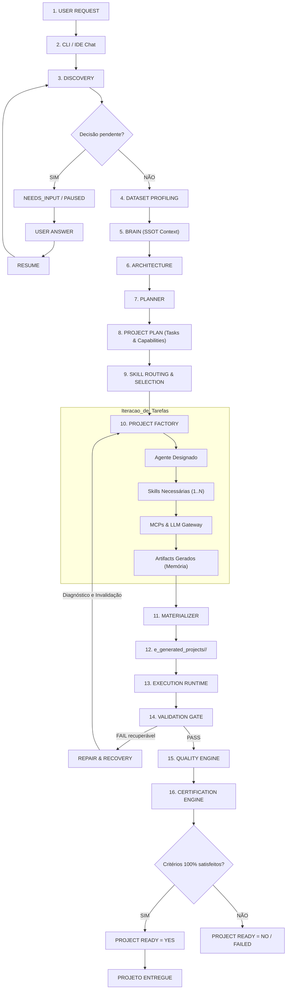

# Golden Path Oficial

> **Documentação Funcional Oficial — Jornada Cronológica de Fabricação**  
> **Status:** Canônico / Normativo  
> **Navegação:** [[a_aaf|Anterior: Visão Geral]] | [[c_discovery_and_input|Próximo: Discovery e Input]]

---

## 1. Visão Geral do Golden Path

O **Golden Path** do Analytics Agents Factory é a esteira canônica, sequencial e determinística que conduz uma intenção em linguagem natural até a entrega física de um projeto de software analítico certificado.

A regra fundamental que rege o Golden Path é: **"Uma fase só libera a execução da próxima se todos os seus contratos e critérios de aceite forem estritamente satisfeitos."** É proibido pular etapas, paralelizar fases com dependência causal ou mascarar saídas incompletas.

---

## 2. Diagrama Conceitual Sequencial

---

## 3. As Fases do Golden Path, Pré-condições e Entradas/Saídas

| Fase | Pré-condições | Entradas | Saídas | Critério de Liberação |
|---|---|---|---|---|
| **1. User Request & Entry** | Plataforma inicializada, workspace disponível. | Prompt do usuário + dataset opcional em `b_input/`. | `ProjectRequest` instanciado com `project_id`. | Criação bem-sucedida do contexto no `StateManager`. |
| **2. Discovery** | Contexto inicial criado. | Prompt e parâmetros de configuração. | Requisitos refinados, escopo e assumptions no Brain. | Ausência de dúvidas bloqueantes (`COMPLETE`). |
| **3. Dataset Profiling** | Dataset físico acessível (se aplicável). | Arquivo bruto em disco (CSV, JSON, etc.). | Estatísticas físicas de dados (`dataset_profile`). | Profiling executado sem mocks com Pandas/DuckDB. |
| **4. Brain Consolidation** | Requisitos e perfil de dados disponíveis. | Requisitos de Discovery + Profile. | `brain_context` com regras de domínio aplicáveis. | Regras e padrões injetados no contexto. |
| **5. Architecture** | Contexto de domínio consolidado no Brain. | `brain_context` + requisitos. | `ArchitectureDecision` (stack, patterns, guardrails). | Decisão técnica fundamentada e compatível com Monolito Modular. |
| **6. Planner** | Decisão de arquitetura formalizada. | `ArchitectureDecision` + `brain_context`. | `ProjectPlan` com DAG de Tasks, Capabilities e Comandos. | Preflight de `CommandPolicy` aprovado e DAG sem ciclos. |
| **7. Skill Routing** | `ProjectPlan` com capabilities declaradas. | Lista de capabilities por Task. | `SkillSelection` ordenada topologicamente. | Skills autorizadas por domínio (`allowed_skills`) e agente (`allowed_agents`). |
| **8. Project Factory** | Seleção de skills e agentes homologada. | `ProjectPlan` + instâncias de agentes. | Coleção de `Artifact` em memória. | 100% dos `expected_artifacts` gerados pelos agentes. |
| **9. Materializer** | Artefatos lógicos compilados em memória. | Lista de `Artifact` + diretório destino. | Arquivos físicos persistidos em `e_generated_projects/<id>/`. | `PathPolicy` respeitada e integridade de gravação física. |
| **10. Runtime** | Arquivos materializados em disco. | `run_commands` planejados. | `ExecutionResult` com logs reais e exit codes. | Execução em subprocesso isolado (`shell=False`, timeout 120s). |
| **11. Validation Gate** | Execução de runtime concluída. | `ExecutionResult` + arquivos em disco. | `ValidationResult` (Estrutura, Sintaxe, Execução). | `py_compile` sem erros e pipelines finalizados com código 0. |
| **12. Quality Engine** | Validation Gate emitir `PASSED`. | Evidências reais de subprocessos. | `QualityResult` (Code, Security, Dependencies). | Ferramentas obrigatórias aprovadas (`pytest`, linter, auditoria). |
| **13. Certification** | Quality Engine emitir `PASSED`. | Todos os relatórios de gates anteriores. | `CertificationResult(status="PASSED")`. | Conjunção lógica estrita de todos os marcos de engenharia. |
| **14. Project Ready** | Certificação aprovada. | `CertificationResult`. | Atribuição `PROJECT READY = YES` e entrega. | Selo final concedido; projeto funcional disponível. |

---

## 4. Integração com o Mecanismo de Pausa e Retomada (`NEEDS_INPUT`)

Quando uma decisão indispensável não puder ser inferida deterministicamente das convenções da fábrica:
1. O `DiscoveryAgent` interrompe o fluxo e solicita o esclarecimento;
2. O sistema entra em `NEEDS_INPUT` e suspende o ciclo em `PAUSED`, persistindo o checkpoint em `h_runtime/state/<project_id>.json`;
3. O usuário fornece a resposta (`aaf resume` ou CLI com `--answer`);
4. A sessão entra em `RESUME`, reidrata o contexto e reprocessa a partir da fase de Discovery sem reiniciar a sessão do zero.

---

## 5. Integração com o Mecanismo de Reparo (`Repair & Recovery`)

Quando ocorre uma falha física de execução ou violação em qualquer gate:
1. O fluxo não é sumariamente abortado como fracasso definitivo;
2. A falha é diagnosticada para isolar a **causa raiz**;
3. O sistema determina a **fase responsável** (seja um erro de script na Factory, uma falha de comando no Planner ou uma inconsistência de modelagem na Architecture);
4. Os artefatos e gates posteriores afetados são **invalidados**;
5. O reparo é executado pelo agente responsável e o fluxo é reprocessado a partir da fase de origem;
6. Todos os gates subsequentes são reavaliados para garantir integridade ponta a ponta.

---

## 6. Target Contract vs. Current Implementation Status

- **Target Contract:** O Golden Path conecta de ponta a ponta a cadeia de causas e efeitos. Qualquer falha em qualquer gate (Validation, Quality, Certification) aciona o diagnóstico de causa raiz e re-executa a partir da fase responsável.
- **Current Implementation Status:** O Golden Path sequencial serial está implementado e orquestrado pelo `MasterOrchestrator`. O ciclo de reparo automático atual opera entre `ValidationGate` e `ProjectRuntime` com até 3 tentativas de regeneração de artefatos. A extensão do loop de recuperação para reprocessar desde Architecture/Planner quando o erro for conceitual representa o contrato alvo.

---

## Navegação

- Documento anterior: [[a_aaf|Visão Geral do AAF]]
- Próximo passo funcional: [[c_discovery_and_input|Discovery e Entrada de Dados]]
- Referência técnica: [[b_contracts_and_state|Contratos e Gerenciamento de Estado]]
