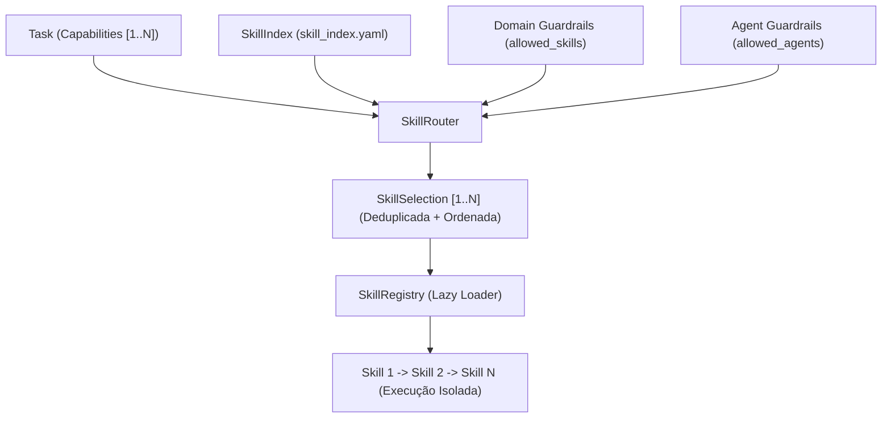

# Agentes, Capabilities e Skills

> **Documentação Funcional Oficial — Responsabilidades e Roteamento de Competências**  
> **Status:** Canônico / Normativo  
> **Navegação:** [[d_planning_and_decomposition|Anterior: Planejamento e Decomposição]] | [[f_project_generation|Próximo: Geração e Fabricação de Projetos]]

---

## 1. A Tríade Canônica: Agente, Capability e Skill

Para eliminar qualquer ambiguidade no design do AAF, a plataforma estabelece uma relação conceitual e operacional inequívoca entre Agentes, Capabilities e Skills:

| Conceito | Pergunta Respondida | Definição Funcional | Exemplo |
|---|---|---|---|
| **Agent** | *Quem é responsável?* | Entidade autônoma especializada designada para conduzir, coordenar e entregar uma tarefa do plano. | `DataAgent`, `AnalyticsAgent`, `TestingAgent` |
| **Capability** | *O que a tarefa precisa?* | Requisito ou competência técnica formal exigida para atender à entrega da tarefa. | `data-cleaning`, `sql-analytics`, `data-quality` |
| **Skill** | *Como a capacidade é executada?* | Módulo atômico e reutilizável que implementa a lógica operacional sob o contrato `SkillContract`. | `b_dataset/cleaning`, `d_data_engineering/sql_analytics` |

---

## 2. Cardinalidade Oficial da Plataforma

A governança arquitetural do AAF consagra a seguinte cardinalidade:

```text
1 Project ────► 1..N Tasks
1 Task    ────► 1..N Capabilities
1 Task    ────► 1 Agente Responsável
1 Task    ────► 1..N Skills (quando a tarefa demandar múltiplas competências)
```

- Um projeto nunca é limitado a uma única skill.
- Uma tarefa pode exigir competências conjugadas (ex: uma tarefa de limpeza pode demandar as capabilities `data-cleaning` e `data-quality`).
- Uma tarefa possui sempre **um único agente responsável**, evitando dispersão de ownership.

---

## 3. A Mecânica de Resolução de Skills

O ecossistema de habilidades do AAF opera através de três componentes complementares:



### 3.1 SkillIndex: Catálogo Compacto de Metadados
O `SkillIndex` (`a_platform/e_skills/skill_index.yaml`) atua como o catálogo oficial de todas as habilidades da plataforma. Ele armazena exclusivamente metadados declarativos leves:
- `skill_id`: Identificador canônico em kebab-case (ex: `etl-pipeline`, `sql-analytics`);
- `category`: Categoria funcional (`dataset`, `analytics`, `data_engineering`, `development`, `quality`);
- `capabilities`: Lista de termos e sinônimos canônicos que a skill atende;
- `allowed_agents`: Lista restritiva de agentes autorizados a invocar a skill;
- `depends_on`: Dependências estruturais entre skills;
- `triggers`: Termos textuais para matching contextual.

### 3.2 SkillRouter: Roteamento Determinístico e Multi-Skill
O `SkillRouter` (`a_platform/e_skills/skill_router.py`) é o motor de inferência que transforma capabilities em uma `SkillSelection` executável:
1. **Ordem de Precedência:**
   - `preferred_skills` explícita e autorizada;
   - `skill_id` explícito e autorizado;
   - Match exato de capability;
   - Verificação de `allowed_skills` do Domínio (`b_domains.yaml`);
   - Verificação de `allowed_agents` da Skill (`skill_index.yaml`);
   - Match por sinônimos e capabilities relacionadas;
   - Match por triggers na descrição da tarefa.
2. **Deduplicação Inteligente:** Se duas capabilities convergirem para a mesma skill (ex: `data-cleaning` e `deduplication`), a skill é agendada uma única vez, cobrindo ambas.
3. **Ordenação Topológica (`depends_on`):** Se a `Skill B` depender da `Skill A`, o roteador garante que a ordem de execução respeite `A → B`.

### 3.3 SkillRegistry: Lazy Loading sob Demanda
O `SkillRegistry` (`a_platform/e_skills/skill_registry.py`) é o despachante de execução. Ele aplica **Lazy Loading**:
- Nenhuma classe Python de skill é instanciada antecipadamente;
- O código, templates e prompts só são carregados da memória e do disco no instante milimétrico em que a tarefa é executada pelo agente responsável;
- Ao término da execução, os recursos são desalocados.

---

## 4. Progressive Disclosure

O AAF aplica rigorosamente o conceito de **Divulgação Progressiva de Informações (Progressive Disclosure)**:

- **Nível 1 (Planejamento / Router):** Apenas metadados compactos do `SkillIndex` trafegam pelo roteador e pelo LLM;
- **Nível 2 (Seleção):** A `SkillSelection` contém apenas identificadores leves (`skill_id`, `capability`, `order`);
- **Nível 3 (Execução):** Somente o agente ativo recebe o prompt especializado e a lógica de execução da skill em curso.

**Regra Absoluta:** É categoricamente proibido despejar o código-fonte de todas as skills no contexto de um agente ou no prompt do modelo.

---

## 5. Guardrails de Domínio e de Agente

O subsistema de Skills possui travas rígidas que impedem violações operacionais:

1. **Domain Guardrails (`allowed_skills`):**  
   Configurados em `a_platform/c_brain/d_domains/b_domains.yaml`. Se um projeto for do domínio `analytics`, skills restritas a infraestrutura não podem ser selecionadas, disparando `SkillRoutingError`.
2. **Agent Guardrails (`allowed_agents`):**  
   Declarados em `skill_index.yaml`. Um `DocumentationAgent` jamais poderá executar a skill `model-training`, mesmo que solicitada, garantindo estrita separação de poderes.

---

## 6. Target Contract vs. Current Implementation Status

- **Target Contract:** Todas as tarefas da fábrica roteiam dinamicamente 1..N capabilities para 1..N skills, garantindo desacoplamento total entre o Planner e o código das skills concretas.
- **Current Implementation Status:** O `SkillIndex`, o `SkillRouter` com ordenação topológica e o `SkillRegistry` com lazy loading e guardrails de domínio/agente estão implementados e funcionais em `a_platform/e_skills/`. O contrato de exceções `SkillRoutingError` está homologado para bloquear desvios de autorização.

---

## Navegação

- Documento anterior: [[d_planning_and_decomposition|Planejamento e Decomposição]]
- Próximo passo funcional: [[f_project_generation|Geração e Fabricação de Projetos]]
- Referência técnica: [[e_agents_and_skills|Agentes e Skills (Técnico)]]
