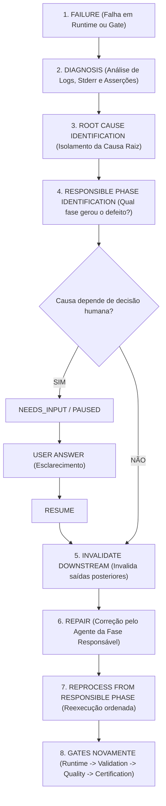

# Reparo e Recuperação (Repair & Recovery)

> **Documentação Funcional Oficial — Ciclo de Auto-Recuperação e Governança de Falhas**  
> **Status:** Canônico / Normativo  
> **Navegação:** [[g_execution_and_gates|Anterior: Execução e Gates]] | [[i_project_ready_and_delivery|Próximo: Project Ready e Entrega]]

---

## 1. Visão Geral e Filosofia de Resiliência

No Analytics Agents Factory, falhas de execução, erros de sintaxe ou reprovações em gates de validação **não são tratadas como sentenças de morte imediatas**. Em sistemas complexos de engenharia de software, falhas acontecem e devem ser gerenciadas com maturidade através de diagnóstico sistemático e auto-recuperação.

### Proibição Absoluta do Encerramento Fatal Precoce
A plataforma consagra uma proibição expressa:
```text
PROIBIDO COMO FLUXO NORMAL:
FAIL ──► PROJECT READY = NO ──► FIM
```
`PROJECT READY = NO` representa unicamente o estado de **"ainda não pronto"** enquanto houver ciclo de reparo em andamento. Não significa desistência automática sem investigação prévia de causa raiz e tentativas estruturadas de correção.

---

## 2. O Fluxo Oficial de Reparo (Repair Contract)

O fluxo obrigatório de tratamento de falhas obedece à seguinte sequência determinística:



---

## 3. Matriz de Diagnóstico: Da Manifestação do Erro à Causa Raiz

Um princípio cardinal do AAF é: **"O local onde o erro se manifesta raramente é o local onde o erro foi originado."** 

A tabela abaixo ilustra a governança de causalidade adotada pelo diagnóstico:

| Onde o Erro se Manifestou | Sintoma Observado | Causa Raiz Real | Fase Responsável pelo Reparo | Ação Corretiva do Reparo |
|---|---|---|---|---|
| **Validation Gate** | Coluna não encontrada na query SQL. | Requisito original mencionava nome de coluna ambíguo. | **Discovery** | Discovery refina requisito com usuário via `NEEDS_INPUT`; reprocessa desde Discovery. |
| **Validation Gate** | Script falha por tipo incorreto (ex: data como int). | Profiling interpretou formato de data erroneamente. | **Dataset Profiling** | Refaz profiling com parser estrito; propaga novo schema para Architecture e Planner. |
| **Execution Runtime** | Falha de importação de biblioteca não instalada. | Arquitetura escolheu framework não suportado na stack. | **Architecture** | Architecture revisa a stack tecnológica, seleciona biblioteca nativa compatível e refaz decisão. |
| **Validation Gate** | Script executa antes da criação do banco de dados. | Planner esqueceu de declarar dependência (`depends_on`). | **Planner** | Planner ajusta o DAG de tarefas; refaz a ordem de execução no `ProjectPlan`. |
| **Project Factory** | Skill selecionada incompatível com o dialeto SQL. | SkillRouter realizou match incorreto de capability. | **Skill Routing** | SkillRouter reavalia capabilities e preferências, selecionando a skill adequada. |
| **Validation Gate** | Script Python com erro de sintaxe (`SyntaxError`). | Agente especialista emitiu código com erro na geração. | **Factory / Agent / Skill** | Agente especialista recebe o `stderr` e stacktrace detalhado, regenerando o artefato defeituoso. |
| **Validation Gate** | Arquivo não encontrado no disco (`FileNotFoundError`). | Materializer violou `PathPolicy` ou path do artefato errado. | **Materializer ou Produtor** | Corrige o caminho canônico do artefato ou ajusta regra de materialização. |
| **Quality Engine** | Teste unitário do `pytest` falhou com asserção. | A regra do pipeline divergiu do teste ou teste inválido. | **DataAgent ou TestingAgent** | Invalida artefatos de teste/código; agente ajusta a lógica e reexecuta a suíte. |
| **Quality Engine** | Auditoria do `bandit` detectou SQL Injection. | Query montada via concatenação direta de strings. | **DatabaseAgent / Skill** | Regenera a query utilizando queries parametrizadas obrigatórias. |
| **Certification** | Falta laudo documental ou `tests_ok = False`. | Gate anterior não foi executado ou laudo corrompido. | **Gate / Fase Omissa** | Identifica a fase omissa e força a reexecução formal com registro de evidência. |

---

## 4. Invalidação a Jusante (`Invalidate Downstream`)

Quando uma falha é rastreada até uma fase anterior (por exemplo, `Architecture`), todos os resultados, artefatos lógicos, arquivos materializados e laudos de gates gerados a partir daquela fase tornam-se **imediatamente inválidos**:
1. O `StateManager` marca as tarefas a jusante como `STALE` ou `PENDING_REPROCESS`;
2. Os artefatos obsoletos são descartados da memória;
3. O projeto é materializado novamente com a nova versão consolidada;
4. Nenhum gate antigo pode ser reaproveitado.

---

## 5. NEEDS_INPUT Durante o Ciclo de Reparo

Se durante o diagnóstico da falha for constatado que a autocorreção é impossível sem arbitrar uma regra de negócio que pertence exclusivamente ao usuário (por exemplo, quando duas colunas possuem dados conflitantes e ambas poderiam ser a chave primária):
1. O diagnóstico marca a causa raiz como `REQUIRES_USER_INPUT`;
2. A fábrica entra em `NEEDS_INPUT` e suspende o ciclo em `PAUSED`;
3. A pergunta pontual e contextualizada é exibida ao usuário;
4. Após o `USER ANSWER`, o fluxo entra em `RESUME` e reprocessa a partir da fase de origem com a nova premissa garantida.

---

## 6. Limites de Tentativas e Esgotamento

Para evitar loops infinitos de reparo automático:
- O ciclo de reparo possui um limite estrito de **3 tentativas** (`max_repair_attempts = 3`);
- Cada tentativa alimenta o agente com o contexto enriquecido de falha (`RepairContext`: histórico de tentativas, `stdout`, `stderr`, código de saída e diagnóstico de anomalia);
- Se após as 3 tentativas a falha persistir e não houver intervenção humana viável, a sessão transiciona formalmente para `FAILED` com relatório detalhado de insucesso.

---

## 7. Target Contract vs. Current Implementation Status

- **Target Contract:** Diagnóstico transversal de causa raiz conectando qualquer gate de auditoria (Validation, Quality, Certification) à fase exata de origem (Discovery, Profiling, Architecture, Planner ou Factory), com invalidação downstream e reprocessamento completo.
- **Current Implementation Status:** O `RepairLoop` (`a_platform/o_orchestration/c_repair_loop.py`) implementa o ciclo de regeneração de artefatos com reexecução e revalidação no `ValidationGate` por até 3 tentativas. A extensão do feedback para fases anteriores (retroalimentando Architecture ou Discovery quando o erro for estrutural) constitui a meta da evolução arquitetural contínua.

---

## Navegação

- Documento anterior: [[g_execution_and_gates|Execução e Portões de Validação]]
- Próximo passo funcional: [[i_project_ready_and_delivery|Project Ready e Entrega]]
- Referência técnica: [[j_repair_orchestration|Orquestração de Reparo (Técnico)]]
