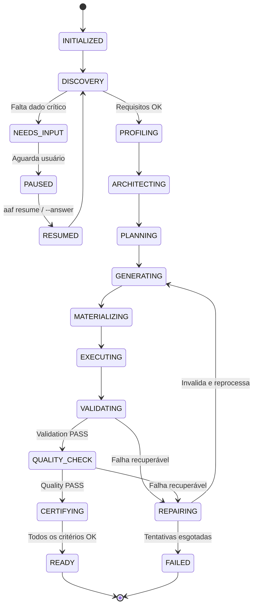

# Contratos e Gerenciamento de Estado (Contracts & State)

> **Documentação Técnica Oficial — Modelos de Dados, DTOs e Máquina de Estados**  
> **Status:** Canônico / Normativo  
> **Navegação:** [[a_system_architecture|Anterior: Arquitetura do Sistema]] | [[c_brain_and_context|Próximo: Brain e Gestão de Contexto]]

---

## 1. Visão Geral dos Contratos da Plataforma

A plataforma AAF é fundamentada em **contratos de dados fortemente tipados** localizados em `a_platform/b_contracts/`. Toda transição de fase, troca de mensagens entre agentes, persistência de artefatos e emissão de laudos é governada por modelos Pydantic ou Dataclasses imutáveis, eliminando o uso de dicionários livres e não tipados para a comunicação crítica.

---

## 2. Principais Modelos e Contratos de Dados

### 2.1 `ProjectRequest` (`a_project.py`)
Encapsula os parâmetros iniciais fornecidos pelo usuário ou interface de transporte:
- `project_id: str`: Identificador alfanumérico único do projeto;
- `prompt: str`: Texto livre em linguagem natural com a intenção do usuário;
- `dataset_path: Optional[str]`: Caminho opcional do arquivo bruto em `b_input/`;
- `dataset_profile: Optional[Dict[str, Any]]`: Metadados do profiling factual;
- `metadata: Dict[str, Any]`: Dicionário para metadados de ciclo de vida (ex: flags de pausa e prontidão).

### 2.2 `ExecutionContext` (`i_execution_context.py`)
Objeto de contexto unificado que trafega por todo o Golden Path, acumulando as evidências de cada etapa:
- `project_id: str`: Identificador do projeto em curso;
- `request: ProjectRequest`: A requisição original;
- `discovery_data: Dict[str, Any]`: Requisitos consolidados e assumptions validadas;
- `brain_context: Dict[str, Any]`: Regras e padrões de domínio recuperados do Brain;
- `architecture_decision: Optional[Any]`: Definição de stack e patterns emitida pelo ArchitectureAgent;
- `plan: Optional[ProjectPlan]`: Plano formal de tarefas emitido pelo PlannerAgent;
- `generated_artifacts: List[Artifact]`: Coleção de artefatos produzidos em memória;
- `execution_results: List[ExecutionResult]`: Histórico de execuções físicas no Runtime;
- `validation_result: Optional[ValidationResult]`: Laudo emitido pelo ValidationGate;
- `quality_result: Optional[QualityResult]`: Laudo emitido pelo QualityEngine;
- `certification_result: Optional[CertificationResult]`: Laudo final emitido pelo CertificationEngine.

### 2.3 `ProjectTask` e `ProjectPlan` (`e_task.py` e `f_plan.py`)
- **`ProjectTask`:**
  - `task_id: str`: Identificador da tarefa (ex: `task_01_ingestao`);
  - `description: str`: Descrição funcional do que deve ser gerado;
  - `assigned_agent: str`: Nome do agente responsável (ex: `DataAgent`);
  - `required_capabilities: List[str]`: Capabilities técnicas exigidas;
  - `required_skills: List[str]`: Skills resolvidas pelo SkillRouter;
  - `depends_on: List[str]`: Lista de IDs de tarefas predecessoras necessárias;
  - `expected_artifacts: List[str]`: Caminhos dos arquivos esperados;
  - `commands: List[str]`: Comandos de validação/teste específicos da tarefa.
- **`ProjectPlan`:**
  - `project_id: str`, `domain: str`, `tasks: List[ProjectTask]`;
  - `run_commands: List[str]`: Sequência de comandos que o Runtime executará;
  - `expected_artifacts: List[str]`: Consolidação de todos os arquivos do projeto.

### 2.4 `Artifact` (`g_artifact.py`)
Representação em memória de um arquivo a ser materializado:
- `identity: str`: ID único do artefato;
- `path: str`: Caminho canônico relativo (ex: `src/pipeline.py`);
- `type: str`: Tipo do conteúdo (`code`, `sql`, `test`, `doc`, `config`);
- `content: str`: Código-fonte ou texto do artefato;
- `producer: str`: Agente e skill responsáveis pela criação;
- `metadata: Dict[str, Any]`: Hash de integridade e permissões.

### 2.5 Evidências de Execução (`h_execution.py`)
- **`CommandExecutionResult`:** Registro de execução de um comando físico:
  - `command: List[str]`: Binário e argumentos sanitizados;
  - `return_code: int`: Código de retorno do processo (0 = sucesso);
  - `stdout: str`, `stderr: str`: Saídas capturadas;
  - `duration_seconds: float`: Tempo de processamento;
  - `status: str`: Status canônico (`PASSED`, `FAILED`, `TIMEOUT`, `DENIED`).
- **`ExecutionResult`:** Agregação de todas as execuções de um ciclo, com sumário executivo e status geral.

### 2.6 Laudos dos Gates de Auditoria
- **`ValidationResult` (`k_validation.py`):** Status geral, relatórios de compilação estática (`py_compile`), conferência de arquivos existentes e erros detalhados;
- **`QualityResult` (`l_quality.py`):** Status geral, score numérico ponderado (0.0 a 1.0) e laudos específicos das dimensões `Code`, `Security`, `Tests` e `Dependencies`;
- **`CertificationResult` (`m_certification.py`):** Status final (`PASSED` ou `FAILED`), checklist de marcos de engenharia cumpridos e autorização para `PROJECT READY = YES`.

---

## 3. O Gerenciador de Estado (`StateManager`)

O `StateManager` (`a_platform/b_contracts/j_state_manager.py`) governa a persistência do ciclo de vida em arquivos JSON estruturados salvos em:
```text
h_runtime/state/<project_id>.json
```

### 3.1 Diagrama de Estados do Ciclo de Vida



---

## 4. Target Contract vs. Current Implementation Status

- **Target Contract:** O `StateManager` opera como um motor de workflow com rollback transacional completo, garantindo que ao retornar a uma fase anterior, todos os laudos e artefatos posteriores sejam invalidados em cascata.
- **Current Implementation Status:** Os modelos Pydantic e Dataclasses de `b_contracts/` estão consolidados e em uso ativo pelo orquestrador. O `StateManager` gerencia as transições de estado essenciais e persiste checkpoints em disco em `h_runtime/state/<project_id>.json`.

---

## Navegação

- Documento anterior: [[a_system_architecture|Arquitetura do Sistema]]
- Próximo passo técnico: [[c_brain_and_context|Brain e Gestão de Contexto]]
- Referência de execução: [[h_runtime_and_command_policy|Runtime e Política de Comandos]]
