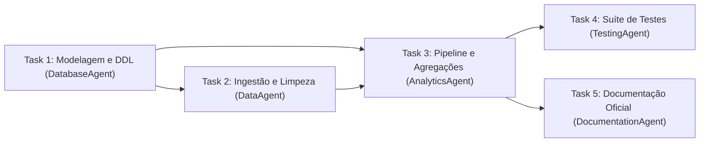

# Planner e Plano de Execução (Planner & Execution Plan)

> **Documentação Técnica Oficial — Planejamento Orientado a Capabilities e Grafo de Execução**  
> **Status:** Canônico / Normativo  
> **Navegação:** [[c_brain_and_context|Anterior: Brain e Contexto]] | [[e_agents_and_skills|Próximo: Agentes e Skills]]

---

## 1. Da Arquitetura ao Planejamento

O ciclo técnico de planejamento tem início na entrega da **`ArchitectureDecision`** pelo `ArchitectureAgent` (`a_platform/g_agents/c_architecture/`). Esta decisão consolida:
- Padrão arquitetural: **Modular Monolith**;
- Dialeto analítico e motor de persistência (ex: SQLite local ou DuckDB);
- Estrutura de diretórios a ser gerada em `e_generated_projects/<project_id>/`;
- Requisitos obrigatórios de governança (uso de CTEs, tipagem estrita, suíte pytest).

O **PlannerAgent** (`a_platform/g_agents/d_planner/k_planner_agent.py`) atua sobre a `ArchitectureDecision`, decompondo a visão macro em uma sequência atômica de trabalho.

---

## 2. Paradigma: Capability-First Planning

O AAF adota o planejamento orientado a capacidades (**Capability-First Planning**):
1. O Planner não associa diretamente código a tarefas;
2. Para cada entrega intermediária, o Planner declara quais **Capabilities** técnicas formais são indispensáveis (ex: `["data-cleaning", "data-quality"]`);
3. Essa declaração desacopla o planejamento da implementação física, permitindo que o `SkillRouter` selecione as melhores ferramentas catalogadas sem engessar o Planner;
4. Assegura que requisitos de governança (como auditoria de qualidade ou documentação) sejam modelados como capabilities explícitas no plano.

---

## 3. O Grafo Acíclico Dirigido (Task DAG)

O `ProjectPlan` (`a_platform/b_contracts/f_plan.py`) é estruturado internamente como um **DAG (Directed Acyclic Graph)**:

### Regras de Resolução do Grafo:
- **Ausência de Ciclos:** O Planner executa algoritmo de detecção de ciclos topológicos antes de homologar o plano. Se houver dependência circular, o plano é imediatamente invalidado;
- **Ordenação Topológica:** As tarefas são serializadas de modo que qualquer tarefa só seja agendada após a conclusão e validação prévia de todas as tarefas declaradas em seu `depends_on`;
- **Herança de Artefatos:** Tarefas a jusante no grafo recebem automaticamente a lista de artefatos gerados pelas tarefas precedentes.

---

## 4. Atribuição de Agentes e Requisitos de Skills

Cada tarefa (`ProjectTask`) possui:
- `assigned_agent`: Nome do agente especializado registrado na `AgentFactory` (`a_platform/g_agents/n_factory/`);
- `required_capabilities`: Lista de capabilities solicitadas;
- `required_skills`: Preenchido dinamicamente pelo `SkillRouter` via chamada `route_selection()`;
- `expected_artifacts`: Lista canônica de caminhos de arquivos esperados em disco ao final da tarefa.

---

## 5. Preflight de Comandos e Execution Plan

Além das tarefas de geração de código em memória, o `ProjectPlan` compõe o **Execution Plan**, que reúne a lista oficial de comandos (`run_commands`) a serem executados pelo Runtime após a materialização:

1. **Submissão ao Preflight:**  
   O Planner submete cada comando planejado (ex: `["python", "-m", "pytest", "tests/"]`) à `CommandPolicy` (`a_platform/k_runtime/b_command_policy/a_policy.py`);
2. **Auditoria Prévia de Segurança:**  
   A `CommandPolicy` analisa se o binário é autorizado (`python`, `pytest`, `pip`), se `shell=False` é respeitado e se não há operadores de injeção (`&&`, `|`, `;`);
3. **Injeção de Testes e Linters:**  
   O Planner injeta compulsoriamente os comandos necessários para que os gates de `Validation` e `Quality` tenham evidências físicas para auditar (ex: execução do script principal, teste com pytest e linter).

---

## 6. Target Contract vs. Current Implementation Status

- **Target Contract:** O `PlannerAgent` otimiza a árvore de tarefas calculando caminhos críticos de dependência e suportando paralelização futura de tarefas independentes quando a fábrica evoluir para execução concorrente.
- **Current Implementation Status:** O `PlannerAgent` decompõe o plano em tarefas seriais com resolução de dependências, injeção de comandos de teste e preflight de segurança via `CommandPolicy`. O roteamento multi-skill via `SkillRouter` está integrado ao ciclo de planejamento.

---

## Navegação

- Documento anterior: [[c_brain_and_context|Brain e Contexto]]
- Próximo passo técnico: [[e_agents_and_skills|Agentes e Skills (Técnico)]]
- Referência de contratos: [[b_contracts_and_state|Contratos e Estado]]
