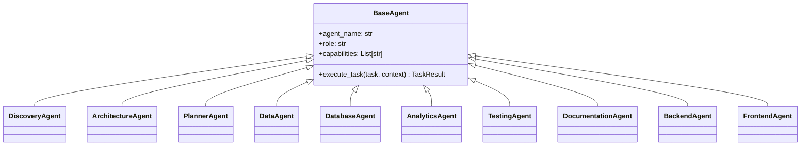

# Agentes e Skills (Agents & Skills Implementation)

> **Documentação Técnica Oficial — Arquitetura de Agentes e Subsistema de Skills**  
> **Status:** Canônico / Normativo  
> **Navegação:** [[d_planner_and_execution_plan|Anterior: Planner e Plano de Execução]] | [[f_mcps_and_llm_gateway|Próximo: MCPs e LLM Gateway]]

---

## 1. Arquitetura de Agentes (`a_platform/g_agents/`)

Os agentes nativos do AAF são entidades autônomas construídas sob o contrato formal `BaseAgent` (`a_platform/b_contracts/b_agent_contract.py`):



### 1.1 A Fábrica de Agentes (`AgentFactory`)
Implementada em `a_platform/g_agents/n_factory/a_agent_factory.py`, a `AgentFactory` instancia dinamicamente os agentes sob demanda do `ProjectPlan`:
- Mantém o catálogo de agentes registrados no `AgentRegistry`;
- Garante injeção de dependências compartilhadas (`SkillRegistry`, `LLMGateway`, `MCPExecutor`, `Brain`);
- Impede a instanciação de agentes não homologados ou fora de escopo.

### 1.2 Segregação de Agentes: Core vs. Condicionais
- **Agentes Core (Mandatórios no Fluxo Padrão):**
  - `DiscoveryAgent`: Elicitação e estruturação de requisitos;
  - `ArchitectureAgent`: Desenho técnico e seleção de stack tecnológica;
  - `PlannerAgent`: Decomposição em tarefas, DAG e validação de comandos;
  - `DataAgent`: Ingestão, higienização, profiling e pipelines ETL;
  - `DatabaseAgent`: Modelagem dimensional, DDL e consultas SQL;
  - `AnalyticsAgent`: Agregações, cálculo de métricas e exploração de dados;
  - `TestingAgent`: Construção e execução da suíte `pytest`;
  - `DocumentationAgent`: Elaboração do `README.md`, dicionários de dados e especificações.
- **Agentes Condicionais (Exclusivamente sob Demanda Explícita):**
  - `BackendAgent`: Criação de APIs REST (FastAPI) para servir dados analíticos;
  - `FrontendAgent`: Construção de interfaces gráficas analíticas (Streamlit/Dash);
  - `ChatbotAgent`: Interfaces conversacionais baseadas em dados analíticos;
  - `InfrastructureAgent`: Manifestos de infraestrutura avançados (Terraform/Kubernetes além do Dockerfile básico).

---

## 2. Subsistema de Skills (`a_platform/e_skills/`)

O subsistema de Skills encapsula as capacidades técnicas granulares da plataforma sob uma arquitetura de quatro camadas:

```text
1. SkillContract ──► Interface Pydantic estrita para todas as Skills
2. SkillIndex    ──► Catálogo leve de metadados (skill_index.yaml)
3. SkillRouter   ──► Motor determinístico de resolução multi-skill e guardrails
4. SkillRegistry ──► Lazy loader sob demanda e executor de skills
```

### 2.1 O Contrato de Habilidades (`SkillContract`)
Localizado em `a_platform/b_contracts/c_skill_contract.py`, define o ciclo de vida obrigatório de cada skill:
1. `validate_input(context)`: Validação de parâmetros requeridos e tipos de dados de entrada;
2. `execute(context)`: Execução da lógica analítica, processamento ou geração de código;
3. `validate_output(result)`: Validação de que a saída contém os artefatos esperados e atende aos critérios de conformidade;
4. Retorna uma instância tipada de `SkillResult`.

### 2.2 O Catálogo Compacto (`SkillIndex`)
O `SkillIndex` (`skill_index.yaml` e `skill_index.py`) armazena metadados compactos:
```yaml
skills:
  - id: "data-cleaning"
    category: "dataset"
    capabilities: ["data-cleaning", "deduplication", "null-handling"]
    allowed_agents: ["DataAgent", "AnalyticsAgent"]
    depends_on: ["data-ingestion"]
```

### 2.3 Roteamento Multi-Skill Determinístico (`SkillRouter`)
O `SkillRouter` (`skill_router.py`) resolve as capabilities de uma tarefa através de seu método `route_selection(...)`:
- **Ordem de Prioridade:** `preferred_skills` → `skill_id` explícito → match exato de capability → verificação de `allowed_skills` do Domínio → verificação de `allowed_agents` da Skill → sinônimos e triggers contextuais;
- **Deduplicação Inteligente:** Evita selecionar a mesma skill múltiplas vezes se diferentes capabilities apontarem para ela;
- **Ordenação Topológica:** Ordena as skills selecionadas com base nas dependências estruturais declaradas em `depends_on`, garantindo que pré-requisitos sejam executados primeiro;
- **Bloqueio de Violações:** Dispara `SkillRoutingError(skill_id=..., agent=..., reason=...)` se o domínio ou o agente não tiverem permissão para executar a skill.

### 2.4 Carregamento sob Demanda (`SkillRegistry` e Lazy Loading)
O `SkillRegistry` (`skill_registry.py`) é responsável por carregar o código das skills:
- **Zero Overhead Inicial:** No arranque da plataforma ou no planejamento, nenhuma classe de skill concreta é carregada;
- **Importação Dinâmica:** O módulo da skill é importado e instanciado exclusivamente quando o agente despacha a chamada `SkillRegistry.run_skill(skill_id, context)`;
- **Descarga:** Ao término da execução, o objeto é liberado, mantendo a pegada de memória reduzida e o contexto do LLM limpo (Progressive Disclosure).

---

## 3. Catálogo Canônico de Skills

| Skill ID | Categoria | Finalidade Técnica | Agentes Autorizados |
|---|---|---|---|
| `dataset-profiling` | `dataset` | Inspeção estatística factual de dados (Pandas/DuckDB) | `DiscoveryAgent`, `DataAgent`, `AnalyticsAgent` |
| `data-ingestion` | `dataset` | Ingestão robusta de arquivos e fontes de dados | `DataAgent` |
| `data-cleaning` | `dataset` | Limpeza, sanitização de nulos e deduplicação | `DataAgent`, `AnalyticsAgent` |
| `data-transformation` | `dataset` | Transformações estruturadas e tipagem de colunas | `DataAgent`, `AnalyticsAgent` |
| `dataset-validation` | `dataset` | Asserções de integridade e validação de schema | `DataAgent`, `TestingAgent` |
| `exploratory-data-analysis` | `analytics` | Análise exploratória descritiva e univariada | `AnalyticsAgent`, `DataAgent` |
| `statistical-analysis` | `analytics` | Estatística inferencial, correlações e distribuições | `AnalyticsAgent` |
| `metrics-analysis` | `analytics` | Cálculo e agregação de KPIs e métricas de negócio | `AnalyticsAgent`, `DatabaseAgent` |
| `data-visualization` | `analytics` | Criação de gráficos e representações visuais | `AnalyticsAgent` |
| `feature-engineering` | `analytics` | Engenharia e encoding de variáveis preditivas | `AnalyticsAgent` |
| `feature-selection` | `analytics` | Seleção de variáveis e redução de dimensionalidade | `AnalyticsAgent` |
| `model-training` | `analytics` | Treinamento supervisionado e validação cruzada | `AnalyticsAgent` |
| `model-evaluation` | `analytics` | Métricas de performance de modelos analíticos | `AnalyticsAgent`, `TestingAgent` |
| `prediction` | `analytics` | Inferência e predição em lote | `AnalyticsAgent` |
| `etl-pipeline` | `data_engineering` | Pipeline completo de ETL determinístico em Python | `DataAgent` |
| `sql-analytics` | `data_engineering` | Criação de queries SQL avançadas com CTEs e agregações | `AnalyticsAgent`, `DatabaseAgent`, `DataAgent` |
| `sql-optimization` | `data_engineering` | Otimização de consultas, planos e índices | `DatabaseAgent`, `AnalyticsAgent` |
| `dimensional-modeling` | `data_engineering` | Modelagem dimensional (Star Schema, fatos e dimensões) | `DatabaseAgent`, `DataAgent` |
| `analytics-engineering` | `data_engineering` | Modelagem analítica modular em camadas (staging/marts) | `AnalyticsAgent`, `DataAgent` |
| `pipeline-observability` | `data_engineering` | Logging estruturado e instrumentação de pipeline | `DataAgent`, `TestingAgent` |
| `technical-documentation`| `development` | Especificações arquiteturais e dicionários de dados | `DocumentationAgent` |
| `readme-generation` | `development` | README.md oficial com comandos de execução e testes | `DocumentationAgent` |
| `architecture-documentation` | `development` | Diagramas de componentes e documentos técnicos | `DocumentationAgent` |
| `data-quality` | `quality` | Testes de integridade de dados e asserções | `DataAgent`, `TestingAgent`, `AnalyticsAgent` |
| `code-quality` | `quality` | Testes automatizados via Pytest e linters | `TestingAgent` |
| `dependency-quality` | `quality` | Pinagem e auditoria de bibliotecas em requirements | `TestingAgent`, `DocumentationAgent` |

---

## 4. Target Contract vs. Current Implementation Status

- **Target Contract:** Registro plugável de skills com validação automática de contratos via decorators e profiling de consumo de tokens por skill.
- **Current Implementation Status:** O `SkillRouter` com multi-skill routing, ordenação topológica e tratamento robusto de exceções `SkillRoutingError`, combinado ao `SkillRegistry` com lazy loading e instancição dinâmica via `AgentFactory`, está plenamente implementado em `a_platform/e_skills/` e `a_platform/g_agents/`.

---

## Navegação

- Documento anterior: [[d_planner_and_execution_plan|Planner e Plano de Execução]]
- Próximo passo técnico: [[f_mcps_and_llm_gateway|MCPs e LLM Gateway]]
- Catálogo funcional: [[e_agents_capabilities_and_skills|Agentes e Skills (Funcional)]]
