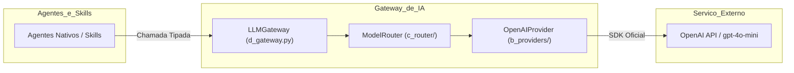

# MCPs e LLM Gateway (Tools & Model Abstraction)

> **Documentação Técnica Oficial — Barramentos de Acesso Operacional e Abstração de Inteligência**  
> **Status:** Canônico / Normativo  
> **Navegação:** [[e_agents_and_skills|Anterior: Agentes e Skills]] | [[g_factory_and_materialization|Próximo: Fábrica e Materialização]]

---

## 1. Subsistema de MCPs (`a_platform/f_mcps/`)

O **Model Context Protocol (MCP)** é o barramento controlado pelo qual agentes e skills interagem com o sistema operacional, bancos de dados locais e containers.

Nenhum agente do AAF possui autorização para invocar bibliotecas nativas de I/O descontrolado (`os.remove`, manipulação direta de arquivos ou conexões cruas a bancos) sem a mediação da camada MCP.

---

## 2. As Ferramentas MCP Homologadas

### 2.1 Filesystem MCP (`a_platform/f_mcps/a_filesystem/`)
- **Papel:** Operações de leitura, escrita e verificação de arquivos no sistema de arquivos;
- **Segurança e Sandbox:** Implementa a checagem `is_safe_path(target_path)`. Qualquer tentativa de escrita fora de `e_generated_projects/` é abortada com erro de violação de segurança;
- **Atomicidade:** Gravação UTF-8 estruturada e criação automática de diretórios intermediários.

### 2.2 Database MCP (`a_platform/f_mcps/b_database/`)
- **Papel:** Execução de scripts DDL e consultas analíticas DML em bancos de dados locais gerados para o projeto (SQLite / DuckDB);
- **Segurança:** Implementa `is_safe_query(sql_query)`:
  - Permite criação de tabelas, índices, inserções, atualizações e queries com CTEs;
  - Bloqueia comandos destrutivos perigosos ou tentativas de contaminação externa (`ATTACH DATABASE`, `DETACH DATABASE`, chamadas de extensão inseguras).

### 2.3 Docker MCP (`a_platform/f_mcps/c_docker/`)
- **Papel:** Gerenciamento e orquestração de containers para isolamento de testes e pipelines complexos;
- **Segurança:**
  - Whitelist restrita de subcomandos autorizados: `["build", "run", "ps", "logs", "stop", "rm"]`;
  - Sanitização de argumentos via `shlex.split`, garantindo a execução como lista com `shell=False`;
  - Proibição absoluta de interpolação de comandos via shell intermediário.

### 2.4 MCP Registry e Executor (`MCPExecutor`)
- **`MCPRegistry` (`f_mcps/d_registry/a_registry.py`):** Catálogo centralizado que mantém os metadados e limites operacionais de cada ferramenta;
- **`MCPExecutor` (`f_mcps/d_registry/b_executor.py`):** Fachada única consumida pelos agentes para invocar operações MCP com telemetria, captura de erros e auditoria de segurança centralizada.

---

## 3. O LLM Gateway (`a_platform/j_llm_gateway/`)

O **LLM Gateway** é o componente de infraestrutura responsável por unificar, isolar e governar todas as inferências com Modelos de Linguagem na plataforma.

---

## 4. Proibição Absoluta de Acoplamento Direto a Provedores

A governança do AAF estabelece uma regra mandatória:
> **"Nenhum arquivo de agente, skill, contrato ou utilitário pode importar diretamente pacotes de provedores de IA (`openai`, `anthropic`, `google.generativeai`). Todo acesso é exclusivamente intermediado pelo LLM Gateway."**

### Vantagens da Abstração:
1. **Portabilidade:** Permite trocar de modelo ou provedor (ex: OpenAI para Anthropic ou modelo local Ollama) sem alterar uma única linha de código dos agentes;
2. **Resiliência Centralizada:** Retries exponenciais, controle de rate limiting e timeouts são configurados em um único local;
3. **Auditoria e Observabilidade:** Rastreamento unificado de tokens consumidos, custos e latência;
4. **Respostas Estruturadas Tipadas:** Converte payloads nativos de provedores na classe canônica `LLMResponse(content=..., model=..., usage=...)`.

---

## 5. Provedor Operacional Padrão: OpenAI Provider

O AAF opera em ambiente padrão utilizando o provedor implementado em:
`a_platform/j_llm_gateway/b_providers/a_openai/a_provider.py`

- **Modelo Canônico:** `gpt-4o-mini` (homologado para velocidade, baixo custo e excelente capacidade analítica estruturada);
- **Autenticação Segura:** Consome estritamente a variável de ambiente `OPENAI_API_KEY` (isolada em `.env` e nunca exposta em logs ou código);
- **Tratamento Antecipado de Ausência de Chave:** Se `OPENAI_API_KEY` estiver ausente ou inválida, o Gateway falha de forma antecipada com `LLMException`, impedindo execuções corrompidas ou geração de dados fictícios.

---

## 6. Target Contract vs. Current Implementation Status

- **Target Contract:** O LLM Gateway suporta chaveamento dinâmico entre múltiplos provedores (OpenAI, Anthropic, Gemini, Ollama local) com fallback automático caso o provedor primário sofra indisponibilidade.
- **Current Implementation Status:** O `LLMGateway` e o `OpenAIProvider` com o modelo de referência `gpt-4o-mini` estão implementados e operam em produção. O barramento de MCPs (Filesystem, Database e Docker) está ativo através do `MCPExecutor`.

---

## Navegação

- Documento anterior: [[e_agents_and_skills|Agentes e Skills (Técnico)]]
- Próximo passo técnico: [[g_factory_and_materialization|Fábrica e Materialização]]
- Referência de segurança: [[k_security_and_guardrails|Segurança e Guardrails]]
