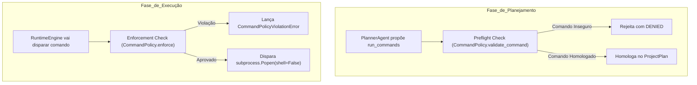

# Runtime e Política de Comandos (Runtime & Command Policy)

> **Documentação Técnica Oficial — Execução Segura em Subprocessos e Gestão de Evidências**  
> **Status:** Canônico / Normativo  
> **Navegação:** [[g_factory_and_materialization|Anterior: Fábrica e Materialização]] | [[i_validation_quality_certification|Próximo: Validação, Qualidade e Certificação]]

---

## 1. O Papel do Execution Runtime (`a_platform/k_runtime/`)

O **Execution Runtime** (`RuntimeEngine` em `a_execution/a_runtime.py`) é o subsistema responsável por executar os comandos reais dos projetos materializados em `e_generated_projects/<project_id>/`.

Sua missão é estritamente operacional e de segurança: executar os scripts do projeto, rodar a suíte de testes unitários e capturar evidências físicas auditáveis para alimentar os portões de validação subsequentes.

---

## 2. A Política de Comandos (`CommandPolicy`)

A segurança do ambiente é garantida pela `CommandPolicy` (`a_platform/k_runtime/b_command_policy/a_policy.py`), que opera em duas etapas:



### Regras de Segurança Estritas da CommandPolicy:
1. **Whitelist Fechada de Binários:** Apenas executáveis homologados podem rodar (`python`, `pytest`, `pip`, `flake8`, `ruff`, `bandit`);
2. **Proibição Absoluta de Shell (`shell=False`):** Os comandos são passados estritamente como lista de strings (`List[str]`), impedindo que interpretadores (`/bin/sh`, `/bin/bash`, `cmd.exe`) avaliem comandos arbitrários;
3. **Bloqueio de Operadores de Injeção:** Strings contendo operadores de encadeamento (`&&`, `||`, `;`, `|`, `>`, `<`) são rejeitadas sumariamente;
4. **Isolamento de Diretório (`CWD`):** O diretório de trabalho é compulsoriamente fixado na raiz do projeto gerado (`e_generated_projects/<project_id>/`).

---

## 3. Disparo Seguro e Captura de Evidências

O disparo de subprocessos pelo Runtime é governado pelas seguintes premissas:

```python
# Padrão de execução segura em RuntimeEngine
process = subprocess.Popen(
    command_args,               # Lista estrita: ["python", "src/pipeline.py"]
    cwd=project_dir,            # CWD restrito ao diretório do projeto gerado
    stdout=subprocess.PIPE,
    stderr=subprocess.PIPE,
    text=True,
    shell=False                 # shell=False OBRIGATÓRIO
)
stdout, stderr = process.communicate(timeout=120)
```

### 3.1 O Objeto de Evidência: `CommandExecutionResult`
Para cada comando executado, o Runtime instancia um registro completo e imutável de evidência:
- `command: List[str]`: Lista de argumentos executados;
- `return_code: int`: Código numérico de retorno do processo (0 = sucesso);
- `stdout: str`: Saída padrão textual capturada;
- `stderr: str`: Saídas de erro e stacktraces capturados;
- `duration_seconds: float`: Tempo decorrido de processamento;
- `task_id: Optional[str]`: Identificador da tarefa do plano associada;
- `status: str`: Status canônico (`PASSED`, `FAILED`, `TIMEOUT`, `DENIED`).

### 3.2 O Agregador de Execução: `ExecutionResult`
A coleção de todos os `CommandExecutionResult` é agrupada em um `ExecutionResult`:
- `overall_status`: Status consolidado (`PASSED` se e somente se todos os comandos retornaram 0);
- `total_commands`: Contagem total de comandos executados;
- `commands: List[CommandExecutionResult]`: Histórico detalhado para auditoria dos gates.

---

## 4. Tratamento de Timeouts e Falhas Anômalas

- **Timeout Estrito de 120s:** Comandos que excedam 120 segundos são terminados forçadamente (`process.kill()`) e registrados com status `TIMEOUT`;
- **Detecção de Falhas Silenciosas:** Mesmo quando um processo retorna código 0, o `stderr` é mantido íntegro para que o `ValidationGate` audite mensagens de aviso ou exceções capturadas de forma disfarçada.

---

## 5. Target Contract vs. Current Implementation Status

- **Target Contract:** O Runtime suporta execução em containers Docker efêmeros descartáveis isolados por projeto via `DockerMCP`, eliminando qualquer interferência com o Python host da máquina do usuário.
- **Current Implementation Status:** O `RuntimeEngine`, a `CommandPolicy` com preflight e enforcement, a execução com `shell=False` e a captura completa de evidências em `ExecutionResult` estão plenamente implementados em `a_platform/k_runtime/`.

---

## Navegação

- Documento anterior: [[g_factory_and_materialization|Fábrica e Materialização]]
- Próximo passo técnico: [[i_validation_quality_certification|Validação, Qualidade e Certificação]]
- Referência de segurança: [[k_security_and_guardrails|Segurança e Guardrails]]
