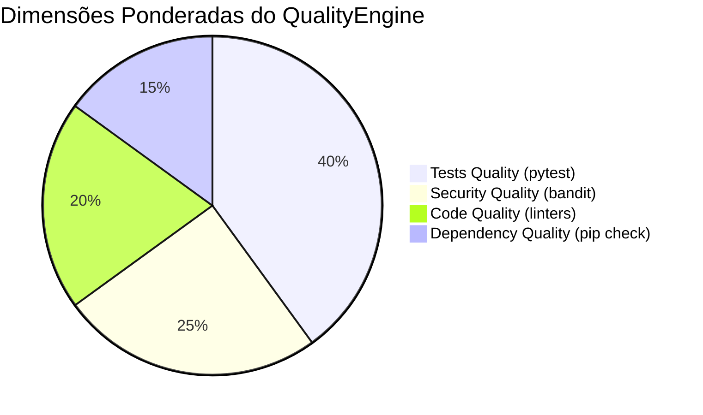

# Validação, Qualidade e Certificação (Audit Gates)

> **Documentação Técnica Oficial — A Tríade de Auditoria Pré-Entrega**  
> **Status:** Canônico / Normativo  
> **Navegação:** [[h_runtime_and_command_policy|Anterior: Runtime e Comandos]] | [[j_repair_orchestration|Próximo: Orquestração de Reparo]]

---

## 1. A Tríade de Auditoria Técnica

O AAF garante a prontidão de seus projetos através de três portões de auditoria sucessivos e independentes:

```text
Execution Runtime (Evidências Físicas)
       │
       ▼
1. ValidationGate (a_platform/l_validation/)
   - Integridade de arquivos no disco
   - Compilação estática de sintaxe Python (py_compile)
   - Validação de códigos de retorno de execução (exit code 0)
       │ (apenas se PASSED)
       ▼
2. QualityEngine (a_platform/m_quality/)
   - Execução e aprovação de testes unitários (pytest)
   - Análise estática de segurança (bandit)
   - Linter e higiene de código (flake8 / ruff)
   - Consistência de dependências (pip check)
       │ (apenas se PASSED)
       ▼
3. CertificationEngine (a_platform/n_certification/)
   - Auditoria holística cruzada de todas as fases antecedentes
   - Verificação da cadeia de custódia das evidências
   - Concessão canônica do selo PROJECT READY = YES
```

---

## 2. Validation Gate (`a_platform/l_validation/`)

O **ValidationGate** (`a_validation_gate.py`) é o primeiro inspetor pós-execução, estruturado em três subvalidadores especializados:

### 2.1 `ProjectValidation` (`d_project_validation.py`)
- Valida a consistência do identificador do projeto (`project_id`);
- Confere se o `ProjectPlan` não está vazio e se a materialização foi concluída com status `SUCCESS`.

### 2.2 `StructureValidation` (`b_structure_validation.py`)
- Confere se todos os arquivos listados em `expected_artifacts` existem fisicamente no disco em `e_generated_projects/<project_id>/`;
- Confere se nenhum arquivo possui tamanho zerado (`os.path.getsize(path) > 0`);
- Executa **compilação estática de sintaxe Python** via módulo padrão `py_compile.compile(path, doraise=True)` para todos os arquivos `.py`, capturando erros de indentação, sintaxe ou incompatibilidades de versão antes que qualquer teste avance.

### 2.3 `ExecutionValidation` (`c_execution_validation.py`)
- Inspeciona o `ExecutionResult` emitido pelo Runtime;
- Verifica se todos os comandos retornaram código de saída estritamente `0`;
- Confere se não houve comandos com status `TIMEOUT` ou `DENIED`.

*Saída:* `ValidationResult(status="PASSED"|"FAILED", checks=[...], errors=[...])`.

---

## 3. Quality Engine (`a_platform/m_quality/`)

O **QualityEngine** (`a_quality_engine.py`) avalia o código e a suíte de testes gerada sob quatro dimensões formais de engenharia de software:



### 3.1 As Quatro Dimensões de Qualidade:
1. **`Tests Quality` (Peso: 0.40):**  
   Audita as evidências de execução da suíte `pytest`. A presença física de arquivos de teste (`test_*.py`) e a passagem de 100% dos testes unitários gerados pelo `TestingAgent` são mandatórias.
2. **`Security Quality` (Peso: 0.25):**  
   Audita os laudos da ferramenta `bandit`. Bloqueia uso inseguro de SQL bruto concatenado, chaves hardcoded e chamadas perigosas de subprocessos.
3. **`Code Quality` (Peso: 0.20):**  
   Audita laudos de linters (`flake8` ou `ruff`), conferindo adesão à PEP 8 e ausência de código morto ou imports não utilizados.
4. **`Dependency Quality` (Peso: 0.15):**  
   Audita a saída de `pip check`, assegurando que as bibliotecas pinadas em `requirements.txt` não possuem conflitos de versão entre si.

### 3.2 Critérios de Aprovação do QualityEngine:
- **Score Ponderado Mínimo:** $\ge 0.75$;
- **Nota Eliminatória:** As dimensões de `Security` e `Tests` exigem nota perfeita ($1.0$). Qualquer falha de segurança ou falha de teste unitário resulta em reprovação sumária (`status = FAILED`), independentemente das outras notas.

---

## 4. Certification Engine (`a_platform/n_certification/`)

O **CertificationEngine** (`a_certification_engine.py`) é a autoridade máxima de auditoria e liberação do AAF:

1. **Inviolabilidade da Cadeia de Custódia:**  
   Não aceita presunções ou aprovações implícitas. Se um laudo de gate estiver ausente ou não contiver logs de subprocessos comprovando sua execução, o motor emite `CertificationResult(passed=False)`;
2. **Conjunção Booleana Estrita:**  
   Aplica a fórmula canônica:
   $$\text{Discovery = COMPLETE} \land \text{Planning = COMPLETE} \land \text{Materialization = SUCCESS} \land \text{Execution = PASSED} \land \text{Validation = PASSED} \land \text{Quality = PASSED}$$
3. **Atribuição do Selo de Prontidão:**  
   Apenas perante aprovação plena, emite `CertificationResult(status="PASSED")`, autorizando o orquestrador a conceder `request.metadata["PROJECT_READY"] = "YES"`.

---

## 5. Target Contract vs. Current Implementation Status

- **Target Contract:** Emissão de laudo consolidado em formato JSON e Markdown assinado digitalmente, com cálculo de cobertura de código (coverage >= 80%) e auditoria de vulnerabilidades de CVEs em dependências via `safety`/`pip-audit`.
- **Current Implementation Status:** Os componentes `ValidationGate`, `QualityEngine` e `CertificationEngine` estão implementados e operam serialmente no `MasterOrchestrator`, inspecionando evidências reais capturadas do `RuntimeEngine`.

---

## Navegação

- Documento anterior: [[h_runtime_and_command_policy|Runtime e Política de Comandos]]
- Próximo passo técnico: [[j_repair_orchestration|Orquestração de Reparo]]
- Visão funcional: [[g_execution_and_gates|Execução e Gates (Funcional)]]
