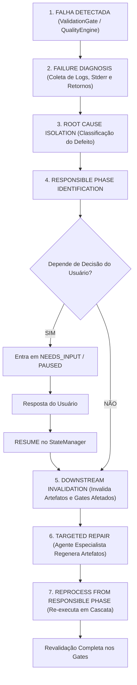

# Orquestração de Reparo (Repair Orchestration)

> **Documentação Técnica Oficial — Resiliência, Diagnóstico de Causa Raiz e Invalidação a Jusante**  
> **Status:** Canônico / Normativo  
> **Navegação:** [[i_validation_quality_certification|Anterior: Validação, Qualidade e Certificação]] | [[k_security_and_guardrails|Próximo: Segurança e Guardrails]]

---

## 1. Visão Geral da Orquestração de Reparo

O subsistema de orquestração do AAF (`a_platform/o_orchestration/`) é projetado para operar sob o princípio da **auto-recuperação determinística**. Quando uma falha é detectada pelo `RuntimeEngine` ou rejeitada por um dos gates de auditoria (`ValidationGate` ou `QualityEngine`), o `MasterOrchestrator` não encerra o processo como fracasso definitivo; ele aciona o motor de reparo para restaurar a conformidade do projeto.

---

## 2. O Ciclo Técnico de Reparo e Recuperação

O pipeline de recuperação segue um ciclo de 7 passos técnicos rigorosamente definidos:

---

## 3. As Etapas Técnicas Detalhadas

### 3.1 Failure Diagnosis (Diagnóstico de Falha)
O orquestrador intercepta a exceção ou a reprovação e monta o objeto estruturado `RepairContext`:
- `attempt_number`: Número sequencial da tentativa corrente (1 a 3);
- `failed_task_id`: Identificador da tarefa que originou o erro;
- `failed_command`: Comando que retornou código de saída diferente de zero;
- `stdout` e `stderr`: Saídas integrais capturadas pelo Runtime;
- `validation_errors`: Lista de asserções reprovadas nos gates.

### 3.2 Root Cause Isolation (Isolamento de Causa Raiz)
O diagnóstico analisa os logs para categorizar a causa raiz:
- **Erro Sintático / Importação:** Falha na geração do código Python ou ausência de importação de módulo;
- **Erro de Schema / SQL:** Tabela ou coluna não encontrada no banco analítico;
- **Erro de Asserção de Dados:** Falha em asserção lógica ou teste unitário do `pytest`;
- **Erro de Dependência / Ambiente:** Pacote Python ausente ou incompatível com a versão;
- **Ambiguidade de Requisito:** Conflito entre premissas declaradas.

### 3.3 Responsible Phase Identification (Identificação da Fase Responsável)
O sistema mapeia a causa raiz para a fase em que o defeito foi originado:
- Se for erro de código/script → **Project Factory (Agente Especialista e Skill)**;
- Se for dependência não declarada no DAG → **PlannerAgent**;
- Se for incompatibilidade de biblioteca com o ambiente → **ArchitectureAgent**;
- Se for ambiguidade insanável de regra → **DiscoveryAgent** (acionando o usuário).

### 3.4 Downstream Invalidation (Invalidação a Jusante)
Uma vez identificada a fase de origem, todos os estados e saídas posteriores são formalmente invalidados:
- Os artefatos em memória afetados são descartados do `GenerationContext`;
- Os arquivos físicos correspondentes em `e_generated_projects/<project_id>/` são marcados para sobrescrita atômica;
- Os laudos dos gates de validação e qualidade são resetados.

### 3.5 Targeted Repair & Reprocessing (Reparo Dirigido e Reexecução)
O agente responsável recebe o `RepairContext` contendo a mensagem exata do erro e instruções de correção:
- O agente corrige o código e re-emite os `Artifacts`;
- O `ArtifactMaterializer` persiste as alterações no disco;
- O `RuntimeEngine` executa novamente os comandos planejados;
- O `ValidationGate`, o `QualityEngine` e o `CertificationEngine` realizam a revalidação completa.

---

## 4. Limites Operacionais e Esgotamento de Tentativas

Para assegurar estabilidade e evitar custos descontrolados de LLM ou loops infinitos de reparo:
- **Teto Máximo:** O ciclo de auto-recuperação repete-se por no máximo **3 tentativas** (`max_repair_attempts = 3`);
- **Falha Definitiva:** Caso a terceira tentativa falhe e não haja alternativa via intervenção humana, a sessão é encerrada com status `FAILED`, emitindo um relatório analítico detalhado das causas da recusa.

---

## 5. Target Contract vs. Current Implementation Status

- **Target Contract (Arquitetura Alvo):**  
  O motor de reparo possui capacidade transversal completa de retroalimentação: se uma falha em Runtime indicar um erro estrutural conceitual de schema, o orquestrador faz rollback automático até o `ArchitectureAgent` ou `PlannerAgent`, invalida o plano a jusante e reprocessa a fábrica a partir dali.
- **Current Implementation Status (Estado Atual do Código):**  
  O componente `RepairLoop` (`a_platform/o_orchestration/c_repair_loop.py`) implementa com sucesso o loop de auto-recuperação localizado entre `ValidationGate` e o `RuntimeEngine`, regenerando artefatos de código com o agente responsável até o limite de 3 tentativas. A extensão desse loop para retroalimentar fases precedentes (Architecture e Planner) de forma transversal é o objetivo de evolução contínua da arquitetura.

---

## Navegação

- Documento anterior: [[i_validation_quality_certification|Validação, Qualidade e Certificação]]
- Próximo passo técnico: [[k_security_and_guardrails|Segurança e Guardrails]]
- Visão funcional: [[h_repair_and_recovery|Reparo e Recuperação (Funcional)]]
